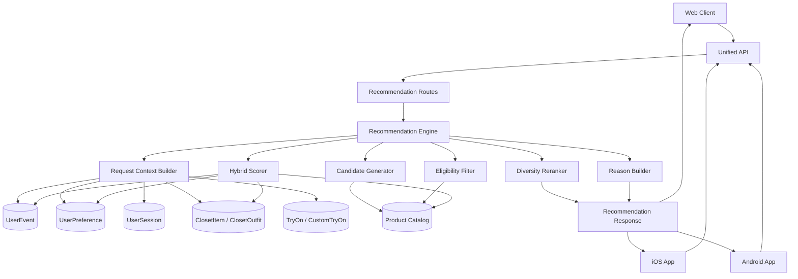
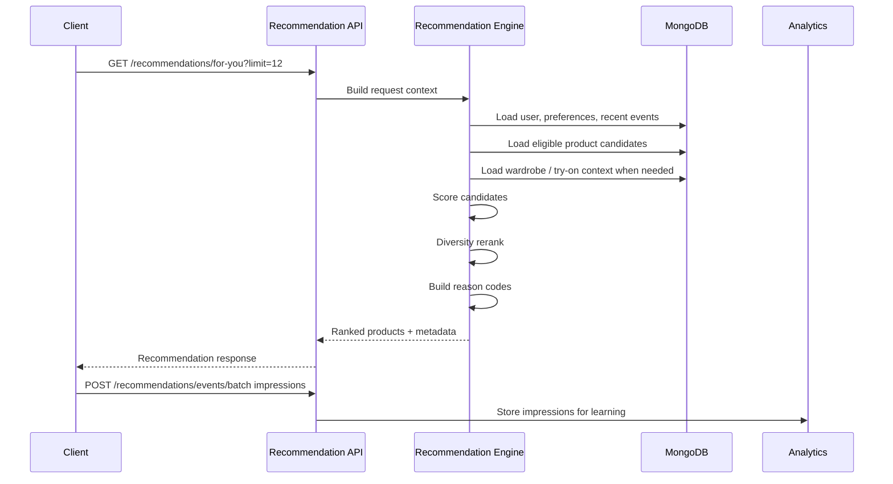
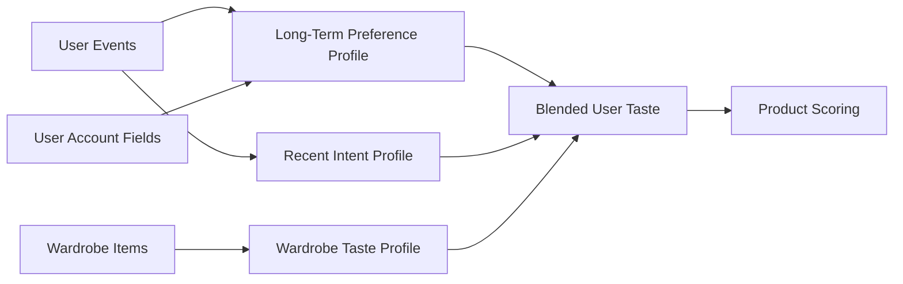
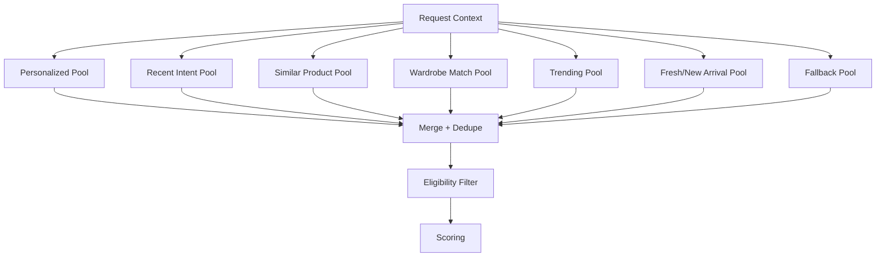
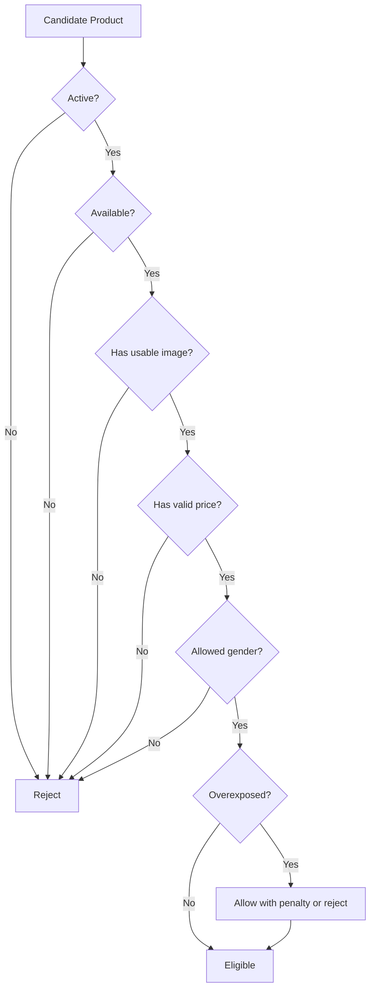
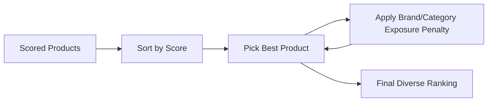
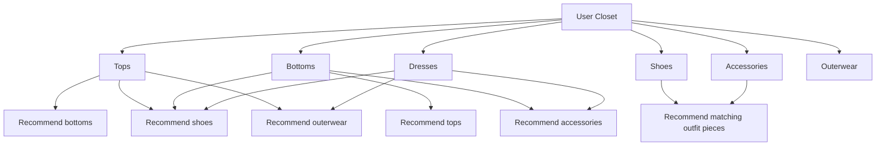
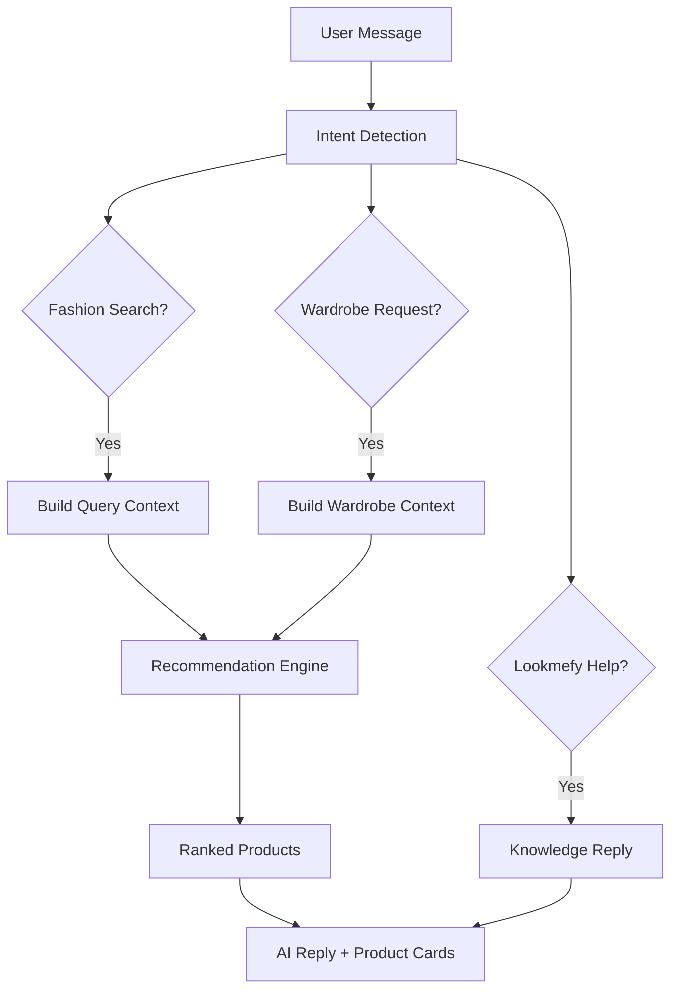
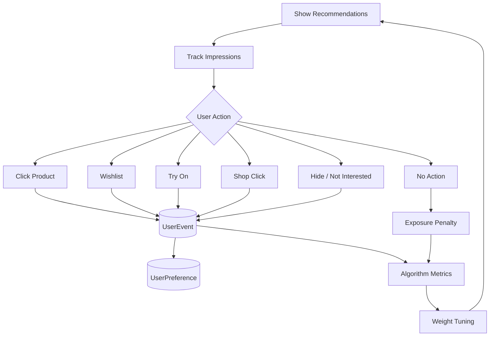

# Lookmefy Recommendation Algorithm Masterplan

## Purpose

Build one recommendation brain for Lookmefy that serves web, iOS, Android, and admin analytics from the unified backend.

The clients should not own ranking logic. Web and app should send context and user events, then render the backend response.

```txt
Web app
iOS app
Android app
Admin analytics
        |
        v
Unified Recommendation API
        |
        v
Shared Recommendation Engine
        |
        v
Products, events, preferences, wardrobe, try-ons, orders
```

## North Star

Lookmefy should recommend products and outfits using:

- User behavior: searches, views, clicks, wishlist, try-ons, shop clicks.
- Product intelligence: category, brand, gender, garment placement, colors, tags, price, rating, availability.
- Wardrobe intelligence: user's uploaded clothes, generated outfits, favorites, wear count, visual profile.
- Session intent: current search, current product, AI Studio message, selected filters, active screen.
- Quality controls: availability, image quality, diversity, freshness, exposure limits.
- Learning loop: impressions, clicks, try-ons, wishlist, shop clicks, orders.

## System Map



## Current Foundation

The root backend already has a usable V1 recommendation base:

- `POST /api/recommendations/events`
- `POST /api/recommendations/events/batch`
- `GET /api/recommendations/for-you`
- `GET /api/recommendations/similar/:productId`
- `GET /api/recommendations/recent-searches`
- `POST /api/recommendations/studio-chat`
- `POST /api/recommendations/stylist-chat`

Current useful models:

- `Product`
- `UserEvent`
- `UserPreference`
- `ClosetItem`
- `ClosetOutfit`
- `TryOn`
- `CustomTryOn`
- `ProductOrder`
- `UserSession`

## Recommendation Surfaces

Each surface should call the same engine with different context and weights.

| Surface | Purpose | Primary Signals |
| --- | --- | --- |
| `for_you` | Home/explore feed | User profile, recent events, popularity, freshness |
| `similar` | Product detail | Product metadata, price, category, brand, tags |
| `complete_the_look` | Product detail / try-on result | Current product, wardrobe, garment placement |
| `from_your_wardrobe` | Closet screen | Closet items, outfit rules, missing pieces |
| `wishlist_next` | Wishlist page | Wishlist items, similar products, complementary items |
| `tryon_next` | After try-on | Tried product, category, user taste, conversion likelihood |
| `ai_studio_search` | AI Studio | Natural language intent, catalog search, user profile |
| `cold_start` | New users | Gender preference, popular products, featured/new arrivals |

## End-To-End Flow



## Data Sources

### Product Catalog

Required ranking fields:

- Product id
- Name
- Brand
- Category
- Gender
- Garment placement
- Price
- Compare-at price
- Currency
- Rating
- Rating count
- Tags
- Colors
- Sizes
- Description
- Image URL
- Availability status
- Featured/new arrival flags
- Source provider
- Source product id

Future enriched fields:

- Normalized category
- Normalized subcategory
- Color family
- Occasion tags
- Formality
- Season
- Fabric/material
- Fit
- Silhouette
- Price band
- Visual embedding
- Text embedding
- Product quality score
- Product popularity score
- Product conversion score

### User Behavior

Existing event types:

- `page_view`
- `search`
- `filter`
- `product_view`
- `product_click`
- `wishlist`
- `wishlist_remove`
- `recommendation_impression`
- `recommendation_click`
- `style_bot_query`
- `custom_tryon`
- `try_on`
- `shop_click`

Recommended future event types:

- `product_hide`
- `not_interested`
- `size_selected`
- `color_selected`
- `add_to_cart`
- `order_completed`
- `wardrobe_item_added`
- `wardrobe_item_favorited`
- `outfit_generated`
- `outfit_favorited`
- `recommendation_request`

## Event Weight Map

Use event weights to infer preference strength.

| Event | Weight | Meaning |
| --- | ---: | --- |
| `recommendation_impression` | 0 | Seen only, used for exposure penalty |
| `page_view` | 0.1 | Weak browsing signal |
| `search` | 1.0 | Intent signal |
| `filter` | 1.25 | Intent refinement |
| `product_view` | 1.5 | Interest |
| `style_bot_query` | 2.0 | Natural language style intent |
| `product_click` | 2.5 | Stronger interest |
| `recommendation_click` | 2.5 | Recommendation engagement |
| `wishlist` | 4.0 | Strong preference |
| `try_on` | 6.0 | Very strong style intent |
| `shop_click` | 8.0 | Very strong buying intent |
| `wishlist_remove` | -2.0 | Negative preference |
| `not_interested` | -5.0 | Strong negative preference |

## User Taste Profile

The user's profile should have two layers:

1. Long-term profile from accumulated behavior.
2. Recent intent profile from session and recent events with time decay.



Recommended profile buckets:

- Categories
- Brands
- Genders
- Tags
- Colors
- Price bands
- Garment placements
- Occasions
- Formality
- Seasons
- Favorite wardrobe traits
- Negative preferences
- Recently exposed product ids

## Time Decay

Recent intent should matter more than old behavior.

```txt
decayedWeight = eventWeight * pow(0.5, ageDays / halfLifeDays)
```

Suggested half-lives:

- Session intent: 1 day
- Recent browsing: 7 days
- Shopping intent: 14 days
- Wishlist/try-on: 30 days
- Long-term profile: no decay or slow monthly decay

## Candidate Generation

The engine should generate candidates from several pools, then dedupe.



Candidate sources by surface:

| Surface | Candidate Pools |
| --- | --- |
| `for_you` | Personalized, recent intent, trending, fresh, fallback |
| `similar` | Similar product, same category, same brand, same price band |
| `complete_the_look` | Complementary garment placement, wardrobe match, similar style |
| `from_your_wardrobe` | Wardrobe complement, missing basics, occasion match |
| `wishlist_next` | Similar to wishlist, complete the look, trending |
| `tryon_next` | Similar to tried product, complementary products, shop-intent products |
| `ai_studio_search` | Query match, semantic match, user taste rerank |
| `cold_start` | Featured, trending, new arrivals, gender preference |

## Eligibility Filter

Before scoring, remove products that should not be recommended.



Eligibility rules:

- Product must be active.
- Product must be available.
- Product must have image, name, category, and price.
- Product must not be an unapproved temporary catalog item.
- Product should respect user gender preference unless unisex/other is acceptable.
- Product should avoid recent overexposure.
- Product should match surface constraints, such as garment placement.

## Hybrid Scoring Formula

```txt
finalScore =
  userTasteScore
+ recentIntentScore
+ contentSimilarityScore
+ wardrobeCompatibilityScore
+ qualityScore
+ freshnessScore
+ popularityScore
+ conversionScore
+ businessScore
- repeatExposurePenalty
- diversityPenalty
- negativePreferencePenalty
```

### Score Components

| Component | Description |
| --- | --- |
| `userTasteScore` | Match with long-term category, brand, gender, tag, color, price preferences |
| `recentIntentScore` | Match with recent search/filter/view/try-on/session behavior |
| `contentSimilarityScore` | Match with current product or wishlist product |
| `wardrobeCompatibilityScore` | Product pairs well with user's closet |
| `qualityScore` | Rating, rating count, image quality, metadata completeness |
| `freshnessScore` | New arrival or recently added product boost |
| `popularityScore` | Global clicks, try-ons, wishlist, shop clicks |
| `conversionScore` | Product historically leads to shop clicks/orders |
| `businessScore` | Featured, approved, strategic collections |
| `repeatExposurePenalty` | User has seen this too often recently |
| `diversityPenalty` | Too many products from same category/brand |
| `negativePreferencePenalty` | User removed, hid, or disliked similar products |

## Surface Weight Matrix

Each surface changes the component weights.

| Component | For You | Similar | Wardrobe | Wishlist | Try-On Next | AI Studio |
| --- | ---: | ---: | ---: | ---: | ---: | ---: |
| User taste | 2.0 | 0.5 | 1.0 | 1.5 | 1.5 | 1.0 |
| Recent intent | 2.5 | 0.5 | 1.0 | 1.5 | 2.0 | 2.0 |
| Content similarity | 1.0 | 4.0 | 1.0 | 2.0 | 2.0 | 1.5 |
| Wardrobe compatibility | 1.0 | 0.5 | 4.0 | 1.5 | 2.0 | 2.0 |
| Quality | 1.0 | 1.0 | 1.0 | 1.0 | 1.0 | 1.0 |
| Freshness | 0.8 | 0.3 | 0.4 | 0.5 | 0.5 | 0.5 |
| Popularity | 1.0 | 0.8 | 0.5 | 0.8 | 0.8 | 0.7 |
| Conversion | 1.0 | 0.7 | 0.5 | 1.0 | 1.2 | 0.7 |
| Business | 0.5 | 0.4 | 0.3 | 0.5 | 0.5 | 0.4 |
| Exposure penalty | 1.5 | 0.5 | 1.0 | 1.0 | 1.0 | 0.7 |

## Diversity Reranking

After scoring, rerank to avoid a boring list.

Rules:

- Limit repeated brands.
- Limit repeated categories.
- Mix price bands when possible.
- Mix fresh products with known popular products.
- Keep top high-confidence products near the top.
- Avoid showing many near-identical products in a row.



## Wardrobe Intelligence

Wardrobe recommendations should be a major product advantage.

Use `ClosetItem` fields:

- Category
- Color
- Fabric
- Pattern
- Season
- Formality
- Occasions
- Tags
- Favorite
- Wear count
- Last worn date
- Visual profile

Use `visualProfile` fields:

- Subcategory
- Primary color
- Secondary colors
- Pattern
- Fabric guess
- Texture
- Fit
- Silhouette
- Formality
- Occasions
- Seasons
- Style tags
- Pairing notes

### Wardrobe Pairing Map



### Wardrobe Rules

- If user has many tops and few bottoms, recommend bottoms.
- If user has many outfits but few shoes/accessories, recommend finishing pieces.
- If user favorites a wardrobe item, recommend products that pair with it.
- If user frequently wears a category, recommend complementary pieces, not duplicates.
- If user has a color-heavy closet, recommend neutral anchors.
- If user has mostly neutral basics, recommend accent pieces.
- If user selects an occasion, prioritize occasion match over generic style.

## AI Studio Integration

AI Studio should not be a separate recommendation system. It should be an intent layer over the same engine.



AI Studio should support:

- Product search by natural language.
- Occasion styling.
- Budget-aware recommendations.
- Wardrobe-first outfit recommendations.
- Follow-up refinements.
- Explainable reasons.
- Try-on-ready product suggestions.

## API Contract

Recommended response shape:

```json
{
  "requestId": "rec_123",
  "surface": "for_you",
  "algorithmVersion": "hybrid-v3",
  "personalized": true,
  "signalCount": 24,
  "products": [
    {
      "id": "product_id",
      "name": "Product name",
      "brand": "Brand",
      "category": "shirts",
      "price": 1499,
      "currency": "INR",
      "imageUrl": "/image.jpg",
      "recommendationScore": 12.45,
      "recommendationReasons": [
        "matches_recent_search",
        "pairs_with_wardrobe",
        "popular"
      ],
      "recommendationContext": {
        "source": "for_you",
        "candidateSources": ["recent_intent", "wardrobe", "popular"],
        "algorithmVersion": "hybrid-v3",
        "rank": 1,
        "personalized": true,
        "confidence": 0.82
      }
    }
  ]
}
```

## Reason Codes

Reason codes should be stable and client-rendered.

| Code | User-Facing Copy |
| --- | --- |
| `matches_recent_search` | Matches your recent search |
| `matches_style` | Matches your style |
| `same_category` | Similar style |
| `same_brand` | From a brand you viewed |
| `similar_price` | In your usual price range |
| `pairs_with_wardrobe` | Pairs with your wardrobe |
| `complete_the_look` | Completes the look |
| `popular` | Popular right now |
| `new_arrival` | New arrival |
| `high_rating` | Highly rated |
| `tryon_ready` | Ready for try-on |
| `wishlist_related` | Inspired by your wishlist |

## Feedback Loop



## Admin Analytics

Admin should be able to see:

- Recommendation requests by surface.
- Impression count.
- Click-through rate.
- Wishlist rate.
- Try-on rate.
- Shop-click rate.
- Order/conversion rate.
- Top clicked products.
- Top ignored products.
- Algorithm version performance.
- Cold-start vs personalized performance.
- Web vs iOS vs Android performance.
- Latency percentiles.
- Error rate.

## Performance Budget

Recommended targets:

- `for_you`: under 250 ms p95 from cache, under 700 ms uncached.
- `similar`: under 150 ms p95 from cache, under 400 ms uncached.
- `ai_studio_search`: under 2 s for catalog-only responses, longer only when LLM/provider calls are intentionally used.
- Candidate pool: 300 to 1000 products.
- Final scoring: in memory after Mongo filters.
- Cache product pools and similar results.
- Do not call external product providers inside normal personalized feed requests.

## Privacy And Safety

Rules:

- Keep recommendations based on first-party behavior and catalog metadata.
- Do not expose private event history to clients.
- Return reason codes, not raw sensitive signals.
- Respect account deletion by deleting events and preferences.
- Avoid using body photos directly for ranking unless user explicitly opts into visual personalization.
- Keep admin analytics aggregated where possible.
- Never include secrets or environment values in recommendation logs.

## Rollout Plan

### Phase 1: Service Refactor

Goal: move recommendation logic out of the route file.

Create:

```txt
server/services/recommendationEngine.js
server/services/recommendationContext.js
server/services/recommendationScoring.js
server/services/recommendationReasons.js
```

No behavior change. Same endpoints, same response compatibility.

### Phase 2: Surface-Aware API

Add optional query/body fields:

- `surface`
- `client`
- `contextProductId`
- `contextClosetItemId`
- `occasion`
- `budgetMin`
- `budgetMax`
- `color`
- `category`

Keep old clients working.

### Phase 3: Richer User Preference Profile

Expand `UserPreference` with:

- colors
- price bands
- garment placements
- occasions
- formality
- negative preferences
- last recomputed timestamp

Backfill from existing events where possible.

### Phase 4: Wardrobe Recommendations

Add wardrobe candidate generation:

- pair products with favorite closet items
- complete outfit gaps
- recommend missing basics
- occasion-based closet matching

Expose through:

```txt
GET /api/recommendations/wardrobe
GET /api/recommendations/complete-the-look
```

Or keep one endpoint:

```txt
GET /api/recommendations/for-you?surface=wardrobe
```

### Phase 5: Popularity And Conversion Scores

Add aggregate product metrics:

- impressions
- clicks
- wishlist adds
- try-ons
- shop clicks
- orders
- CTR
- try-on rate
- shop-click rate

Compute periodically with a worker or scheduled script.

### Phase 6: Request Logging And A/B Testing

Add recommendation request records:

- request id
- user id
- surface
- algorithm version
- candidate sources
- product ranks
- response latency

Support:

- `hybrid-v2` current
- `hybrid-v3` new weighted algorithm
- future `embedding-v1`

### Phase 7: Embeddings

Only after metadata and analytics are strong, add embeddings.

Use embeddings for:

- semantic product search
- similar products
- AI Studio natural-language matching
- visual style similarity
- wardrobe style matching

Keep business rules and eligibility filters around vector results.

## Algorithm Versions

| Version | Purpose |
| --- | --- |
| `hybrid-v2` | Current root backend algorithm |
| `hybrid-v3` | Surface-aware weighted recommender |
| `wardrobe-v1` | Wardrobe-aware outfit/product matching |
| `semantic-v1` | Text embedding retrieval |
| `visual-v1` | Image/style embedding retrieval |

## Implementation Principle

Start simple and measurable.

The first real production improvement should be a clean service-based `hybrid-v3`, not a heavy ML system. Once event tracking and admin metrics prove which signals matter, embeddings and ML reranking can be added with confidence.

