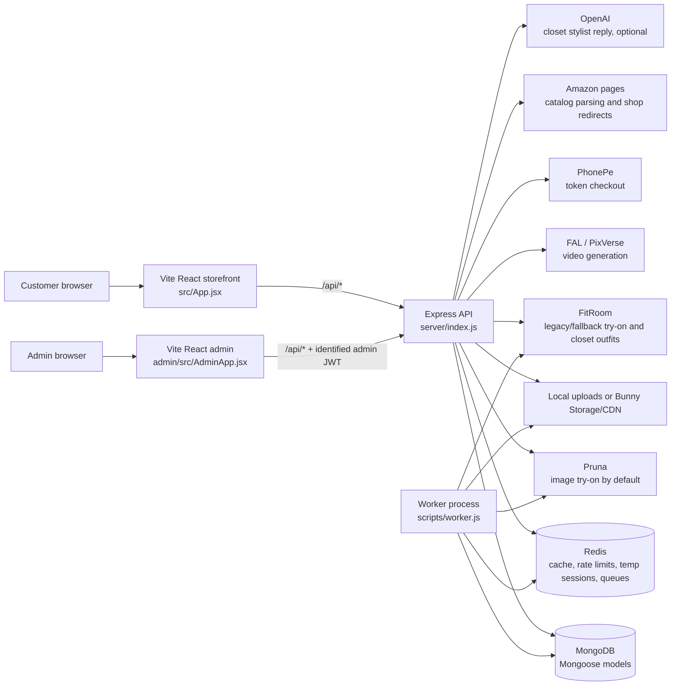
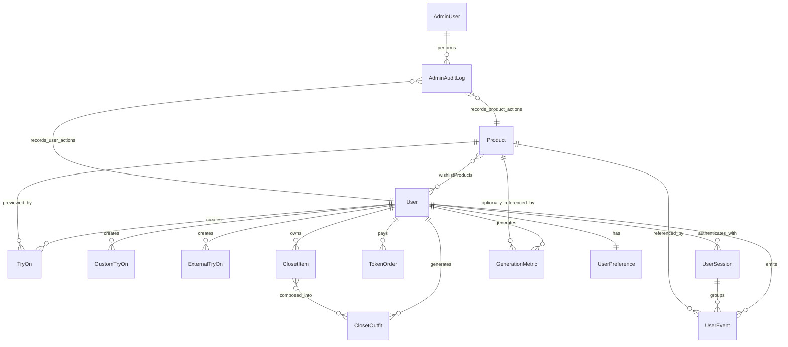
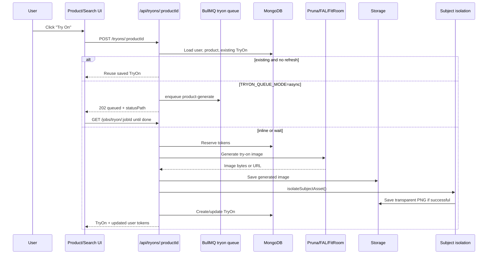
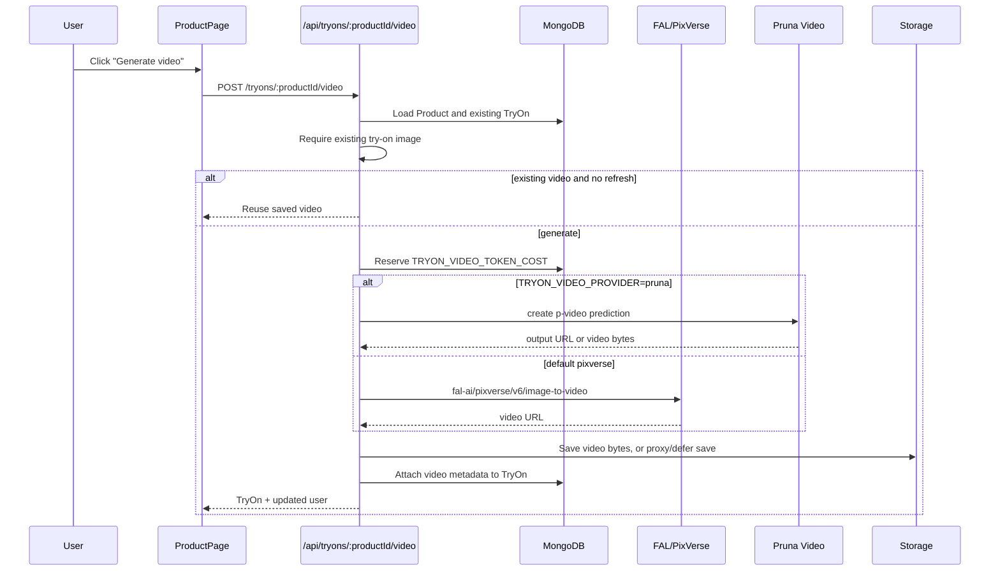
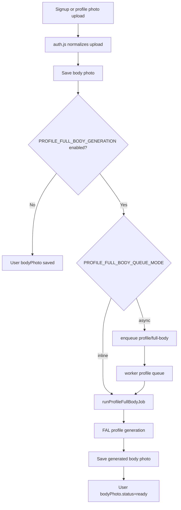
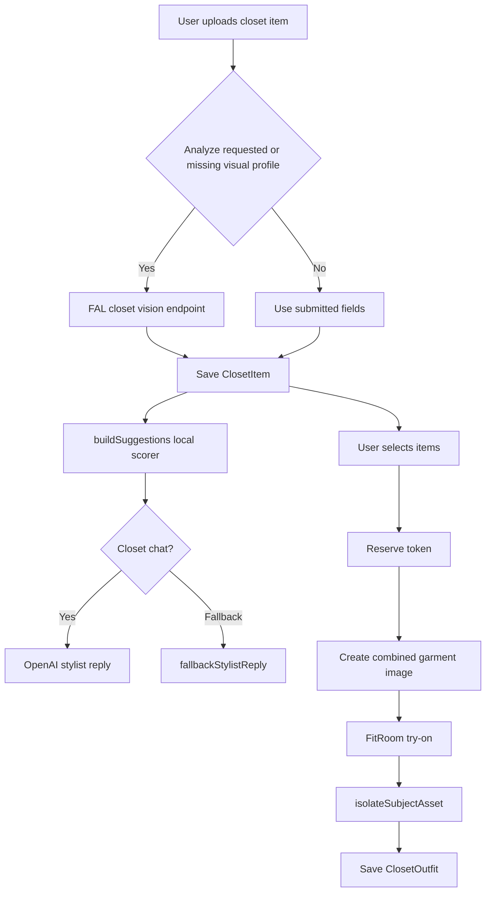
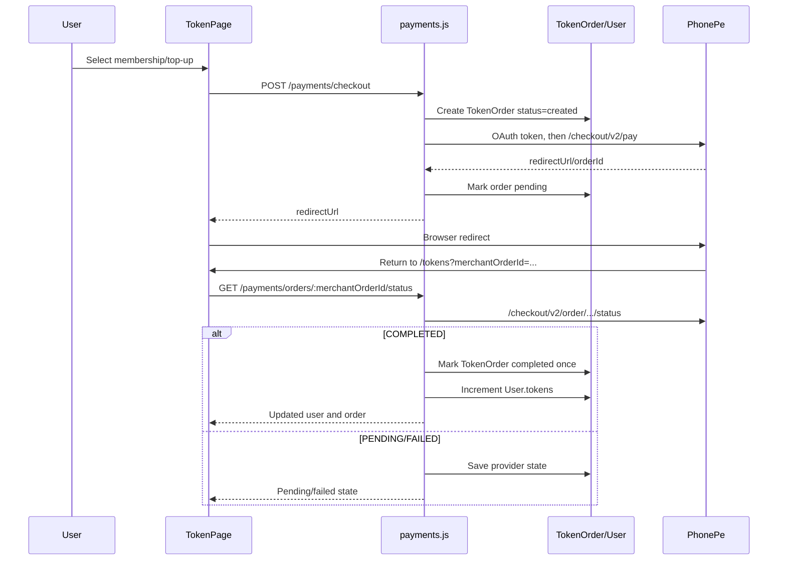
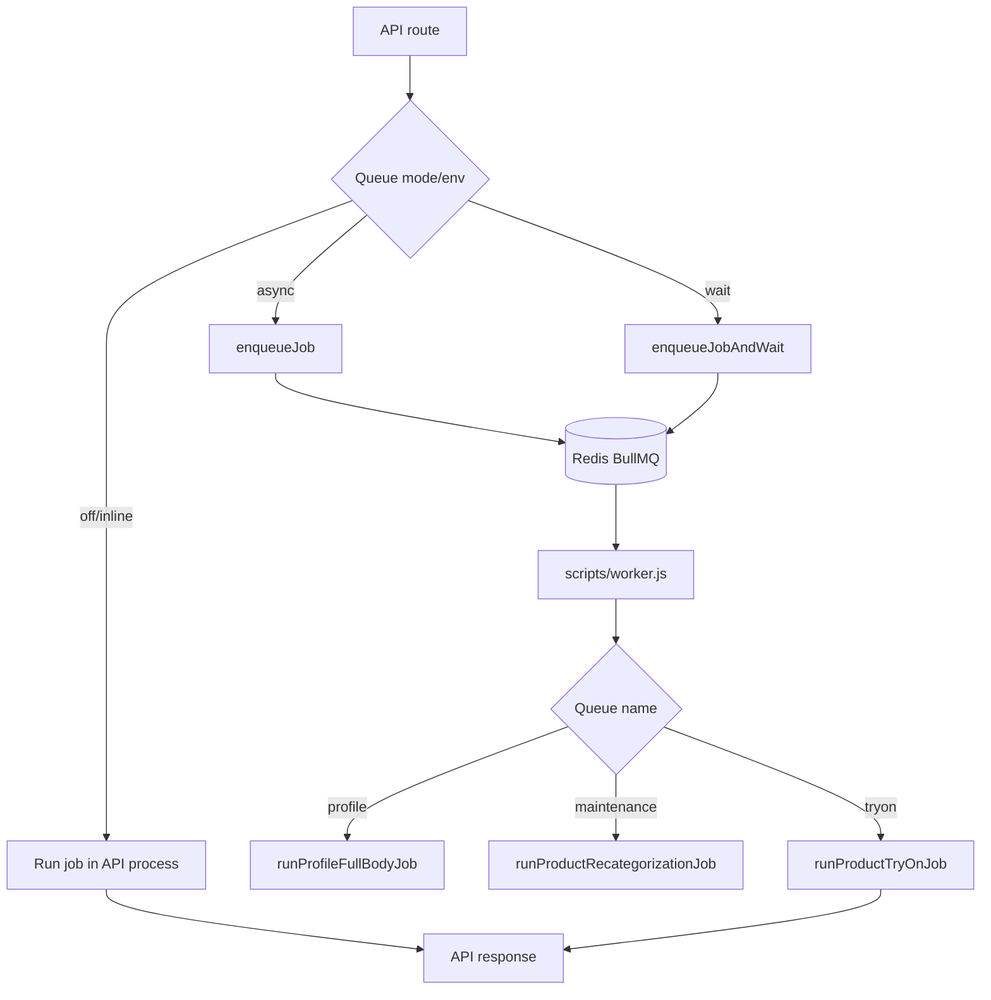
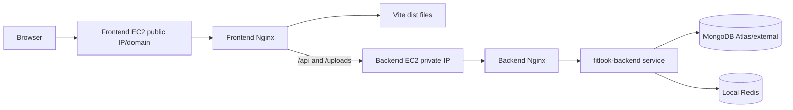

# Lookmefy Architecture Map

Last updated: 21 August 2026

This document maps the current Lookmefy codebase from the outside in: what starts the app, what each page calls, what each backend route triggers, which models are touched, and which external providers are involved.

It intentionally references environment variable names only. Do not place secret values in this document.

## 1. System Overview



The current production path is:

- Customer UI: `src/main.jsx` -> `src/App.jsx` -> `src/styles.css`.
- Admin UI: `admin/src/main.jsx` -> `admin/src/AdminApp.jsx`.
- API: `server/index.js`, mounted under `/api`.
- Worker: `scripts/worker.js`, used only when queues are enabled and an app role starts the worker.
- Data: MongoDB via Mongoose models in `server/models`.
- Cache/queue/rate-limit helper: Redis via `server/utils/cache.js` and `server/utils/jobQueue.js`.
- Uploads/media: local `uploads/` or Bunny via `server/utils/storage.js`.

There is also a `web/` Next.js app and `pruna-test-node/` test harness. They are separate from the current root package scripts and are not the active production storefront unless deployed separately.

## 2. Runtime Entry Points

| Runtime | Entry Point | Start Command | What It Does |
|---|---|---|---|
| Customer storefront | `src/main.jsx` | `npm run dev` / `npm run build` | Mounts React app with `ErrorBoundary`, runtime error tracking, and `App`. |
| Admin app | `admin/src/main.jsx` | `npm run admin:dev` / `npm run admin:build` | Mounts admin console. |
| API server | `server/index.js` | `npm run server` | Loads `.env`, validates required env, connects MongoDB, mounts routes, starts Express. |
| Worker | `scripts/worker.js` | `npm run worker` | Connects MongoDB, starts BullMQ workers for profile, maintenance, try-on queues. |
| Role launcher | `scripts/start-role.js` | `npm run start:role` | Uses `APP_ROLE` to start API, worker, scheduler, or both. |
| Product import | `scripts/import-products.mjs` | `npm run catalog:import` | Imports Amazon/product manifest rows into MongoDB. |
| Index creation | `scripts/create-indexes.js` | `npm run db:create-indexes` | Syncs Mongo indexes for all models. |
| Storage migration | `scripts/migrate-uploads-to-bunny.js` | `npm run storage:migrate:bunny:apply` | Migrates local stored media to Bunny-backed storage. |

## 3. Backend Boot Sequence

`server/index.js` does this in order:

1. Loads env with `dotenv.config()`.
2. Blocks startup if `APP_ROLE` is not `api` or `all`.
3. Creates Express app.
4. Applies trust proxy, disables `x-powered-by`, applies security headers.
5. Configures CORS using `CLIENT_ORIGIN`, `ADMIN_ORIGIN`, `ALLOWED_ORIGINS`, and local dev origin rules.
6. Parses JSON body.
7. Adds request metrics logging.
8. Serves `/uploads` through `serveUploadedMedia()` instead of raw static serving.
9. Applies global `/api` rate limit.
10. Mounts route modules.
11. Exposes health and admin metrics endpoints.
12. Validates env with `validateServerEnv()`.
13. Connects MongoDB.
14. Starts HTTP server.
15. On shutdown, closes HTTP, queues, Redis, and MongoDB.

Mounted backend routes:

| Prefix | File | Purpose |
|---|---|---|
| `/api/auth` | `server/routes/auth.js` | Signup/login, OTP sessions, user profile, body photo, wishlist, admin login/users. |
| `/api/closet` | `server/routes/closet.js` | Wardrobe items, outfit suggestions, closet chat, closet outfit generation. |
| `/api/payments` | `server/routes/payments.js` | PhonePe checkout, order status, token history. |
| `/api/products` | `server/routes/products.js` | Product catalog, Amazon search, admin product CRUD, recategorization. |
| `/api/recommendations` | `server/routes/recommendations.js` | Event tracking, personalized products, similar products, admin stats. |
| `/api/tryons` | `server/routes/tryons.js` | Product try-on image generation, custom try-on, external try-on, video generation. |
| `/api/images` | `server/routes/images.js` | Subject isolation/background removal for uploaded media. |
| `/api/jobs` | `server/routes/jobs.js` | Authenticated polling for queued jobs. |

## 4. Backend Route Reference

This is the API surface as currently mounted by `server/index.js`.

### Auth Routes

| Method | Path | Auth | Trigger / Caller | Main Downstream Calls |
|---|---|---|---|---|
| `POST` | `/api/auth/signup/request-otp` | Public + rate limit | Signup phone step | `createTempSessionStore`, HMAC OTP digest. |
| `POST` | `/api/auth/signup/verify-otp` | Public + rate limit | Signup OTP confirm | Temp session update. |
| `POST` | `/api/auth/signup` | Public + verified OTP | Signup form submit | Upload normalization, `User.create`, `UserSession.create`, optional profile full-body generation. |
| `GET` | `/api/auth/username-suggestions` | Public + rate limit | Signup username field | `User.exists`. |
| `POST` | `/api/auth/login` | Public + rate limit | Password login | `User.findOne`, `bcrypt.compare`, `UserSession.create`, JWT sign with session ID. |
| `POST` | `/api/auth/login/request-otp` | Public + rate limit | OTP login phone step | `User.findOne`, temp session. |
| `POST` | `/api/auth/login/verify-otp` | Public + rate limit | OTP login confirm | Temp session, `User.findById`, `UserSession.create`, JWT sign with session ID. |
| `POST` | `/api/auth/session/heartbeat` | User | Visible storefront heartbeat | Atomically updates last activity, active duration, and last route. |
| `POST` | `/api/auth/logout` | User | Header/profile logout | Closes the JWT's `UserSession` with an explicit logout time. |
| `POST` | `/api/auth/admin-request-access` | Public | Admin access request form | Creates a pending `AdminUser` with a bcrypt password hash and no section access. |
| `POST` | `/api/auth/admin-login` | Admin email + password | Admin login | `AdminUser`, `bcrypt.compare`, `signAdminSession`; pending accounts receive no session. |
| `GET` | `/api/auth/admin-session` | Admin | Admin session restore | Reloads current `AdminUser` role and section access. |
| `GET` | `/api/auth/admin/users` | User Operations | Admin users page | `User`, `TokenOrder`, `UserSession`, and `UserEvent` aggregations. |
| `GET` | `/api/auth/admin/users/:id/insights` | Admin | User detail drawer | Session timeline, activity, preferences, and top products. |
| `GET` | `/api/auth/admin/users/:id/media` | Admin | User detail media tab | Profile, try-on, closet media, and Bunny byte usage. |
| `GET` | `/api/auth/admin/storage` | User Operations | Storage page | Paginated image/video index and database-tracked Bunny usage. |
| `GET` | `/api/auth/admin/storage/reconciliation` | User Operations | Bunny reconciliation | Recursively lists Bunny and compares live keys with MongoDB references. |
| `DELETE` | `/api/auth/admin/storage/orphans` | User Operations | Guarded orphan deletion | Re-verifies old orphans, requires typed confirmation, deletes from Bunny, writes audit log. |
| `GET` | `/api/auth/admin/orders` | User Operations | Orders page | Paginated/filterable `TokenOrder` history. |
| `GET` | `/api/auth/admin/search` | User Operations | Global admin search | Searches all matching users/products in MongoDB. |
| `GET` | `/api/auth/admin/operations` | User Operations | Overview snapshots | Latest `TokenOrder` records and totals. |
| `GET` | `/api/auth/admin/audit-log` | System Management | Audit log page | Paginated/filterable `AdminAuditLog`. |
| `PATCH` | `/api/auth/admin/users/:id/tokens` | User Operations | Admin token edit | `User` update, `recordAdminAudit`. |
| `GET` | `/api/auth/me` | User | App/profile session restore | `requireUser`, `User.toClient`. |
| `PATCH` | `/api/auth/onboarding` | User | Onboarding complete | `User.onboardingSeenAt`. |
| `GET` | `/api/auth/wishlist` | User | Wishlist page | `Product.find`, cleans inactive saved IDs. |
| `POST` | `/api/auth/wishlist/sync` | User | Login/local wishlist merge | `User.wishlistProducts`, `Product.find`. |
| `PUT` | `/api/auth/wishlist/:productId` | User | Save product | `$addToSet` wishlist product. |
| `DELETE` | `/api/auth/wishlist/:productId` | User | Remove product | `$pull` wishlist product. |
| `PATCH` | `/api/auth/dev-mode` | User + dev env | Dev-only billing bypass toggle | `developmentBillingBypass` controls later token charge behavior. |
| `POST` | `/api/auth/body-photo` | User | Profile photo upload | Upload normalization, storage, optional full-body generation. |
| `POST` | `/api/auth/body-photo/generate-full-body` | User | Regenerate body/profile photo | Queue or inline `runProfileFullBodyJob`. |

### Product Routes

| Method | Path | Auth | Trigger / Caller | Main Downstream Calls |
|---|---|---|---|---|
| `GET` | `/api/products` | Public + rate limit | Catalog/search/category pages, admin inventory | `Product.find`, facets, hybrid cache. |
| `POST` | `/api/products/amazon-search` | User | AI Stylist product search | Amazon HTML fetch, parser, wearable/gender filters. |
| `POST` | `/api/products/recategorize` | Admin | Admin recategorize action | Inline or `maintenance` queue, `Product` updates, cache clear. |
| `GET` | `/api/products/:id` | Public + rate limit | Product page/detail cards | `Product.findOne`, hybrid cache. |
| `POST` | `/api/products/preview-link` | Admin | Admin affiliate preview | `buildProductDraft`, remote fetch/parser. |
| `POST` | `/api/products` | Admin | Admin create product | Upload normalization/storage, `Product.create`, audit, cache clear. |
| `PATCH` | `/api/products/:id` | Admin | Admin edit/bulk edit | `Product` update, audit, cache clear. |
| `PATCH` | `/api/products/:id/garment-placement` | Admin | Admin fit area control | `Product.garmentPlacement`, audit, cache clear. |
| `PATCH` | `/api/products/:id/tryon-model` | Admin | Admin model control | `Product.tryOnModel`, audit, cache clear. |
| `DELETE` | `/api/products` | Admin | Admin remove all | Soft-deactivate active products, audit, cache clear. |
| `DELETE` | `/api/products/:id` | Admin | Admin remove product | Soft-deactivate product, audit, cache clear. |

### Try-On Routes

| Method | Path | Auth | Trigger / Caller | Main Downstream Calls |
|---|---|---|---|---|
| `GET` | `/api/tryons` | User | Product/search page load saved previews | `TryOn.find` by user/product IDs. |
| `GET` | `/api/tryons/:tryOnId/video/media` | Public-ish proxy | Video playback for proxied Pruna output | `fetchPrunaOutput`, stream upstream body. |
| `POST` | `/api/tryons/custom` | User | Custom clothing upload | Token reserve, Pruna/FitRoom, storage, subject isolation, `CustomTryOn`. |
| `POST` | `/api/tryons/external` | User | External Amazon product try-on | Compatibility checks, token reserve, Pruna/FitRoom, `ExternalTryOn`. |
| `POST` | `/api/tryons/:productId/video` | User | Product video generation | Existing `TryOn` required, token reserve, PixVerse/FAL or Pruna, update `TryOn.video`. |
| `POST` | `/api/tryons/:productId` | User | Product image try-on | Inline/queued token reserve, Pruna/FAL/FitRoom, `TryOn`. |

### Closet Routes

| Method | Path | Auth | Trigger / Caller | Main Downstream Calls |
|---|---|---|---|---|
| `GET` | `/api/closet` | User | Wardrobe pages | `ClosetItem`, `ClosetOutfit`, local suggestions. |
| `POST` | `/api/closet/items/analyze` | User | Closet upload preview | Upload normalization, optional FAL vision analysis. |
| `POST` | `/api/closet/items` | User | Save closet item | Upload normalization/storage, optional analysis, `ClosetItem.create`. |
| `PATCH` | `/api/closet/items/:id` | User | Edit closet item | Owned `ClosetItem` update. |
| `DELETE` | `/api/closet/items/:id` | User | Delete closet item | Owned `ClosetItem` delete, stored file delete. |
| `POST` | `/api/closet/suggest` | User | Wardrobe suggestions | Local scorer over closet items. |
| `POST` | `/api/closet/chat` | User | Wardrobe stylist chat | Local suggestions + optional OpenAI reply. |
| `POST` | `/api/closet/outfits/generate` | User | Generate wardrobe look | Token reserve, combine garments, FitRoom, subject isolation, `ClosetOutfit`. |
| `PATCH` | `/api/closet/outfits/:id` | User | Update generated outfit | Favorite/title/planned date update. |

### Payments Routes

| Method | Path | Auth | Trigger / Caller | Main Downstream Calls |
|---|---|---|---|---|
| `GET` | `/api/payments/plans` | Public | Token page plan load if used | Static plan definitions and token costs. |
| `GET` | `/api/payments/credits/history` | User | Profile credit history | `TokenOrder`, `TryOn`, `CustomTryOn`, `ClosetOutfit`. |
| `POST` | `/api/payments/checkout` | User | Token checkout button | `TokenOrder.create`, PhonePe OAuth, `/checkout/v2/pay`. |
| `POST` | `/api/payments/phonepe/subscription` | User | Subscription alias route | Same as normal checkout for monthly plan. |
| `GET` | `/api/payments/orders/:merchantOrderId/status` | User | Return from PhonePe | PhonePe status lookup, `grantPaidTokens`. |
| `POST` | `/api/payments/phonepe/callback` | Public callback | PhonePe callback | Acknowledge fast, background `reconcileOrder`. |

### Recommendation, Image, Job, Health Routes

| Method | Path | Auth | Trigger / Caller | Main Downstream Calls |
|---|---|---|---|---|
| `POST` | `/api/recommendations/events` | User | `recordEvent()` | `UserEvent.create`, `UserPreference` update, `UserSession` activity update. |
| `POST` | `/api/recommendations/events/batch` | User | Visible recommendation cards | Validated, session-linked recommendation impression insert. |
| `GET` | `/api/recommendations/admin/stats` | Admin | Admin analytics | Date-scoped event, session, recommendation, product, search, and generation aggregations. |
| `GET` | `/api/recommendations/for-you` | User | Home/product rails | Preference-ranked product list. |
| `GET` | `/api/recommendations/similar/:productId` | Public | Product page related rail | Product similarity ranking. |
| `POST` | `/api/images/subject-isolation` | User | Retry transparent cutout | `isolateSubjectAsset`. |
| `GET` | `/api/jobs/:queueName/:jobId` | User | Poll queued jobs | `getJobStatus`, owner validation. |
| `GET` | `/api/health` | Public | Health check | Static ok. |
| `GET` | `/api/health/live` | Public | Liveness check | Service metadata. |
| `GET` | `/api/health/ready` | Public | Readiness check | Mongo/Redis/shutdown readiness. |
| `GET` | `/api/admin/metrics` | System Management | Admin/system metrics | `observabilitySnapshot`. |
| `GET` | `/api/metrics/prometheus` | Metrics bearer token | Prometheus collector | Aggregated request/runtime/Nginx metrics in Prometheus text format. |

## 5. Route-To-Utility Dependency Map

| Route File | Models Used | Core Utilities / Services | External Calls |
|---|---|---|---|
| `auth.js` | `AdminUser`, `User`, `Product`, `TokenOrder`, `UserSession`, `UserEvent`, `UserPreference`, `AdminAuditLog` | `adminAccess`, `adminPermissions`, `adminAudit`, `userSessions`, `genderPreference`, `jobQueue`, `rateLimit`, `storage`, `security`, `tempSessions` | FAL profile generation. |
| `admin.js` | `AdminUser`, `SystemIncident` | `adminAccess`, `adminPermissions`, `adminAudit`, `adminManagement`, `rateLimit` | Cost and system provider summaries. |
| `products.js` | `Product` | `cache`, `rateLimit`, `wearable`, `genderPreference`, `jobQueue`, `adminAudit`, `adminAccess`, `storage`, `security`, `tryOnModel` | Amazon/search/product pages. |
| `tryons.js` | `TryOn`, `CustomTryOn`, `ExternalTryOn`, `GenerationMetric`, `Product`, `User` | `tryOnModel`, `generationMetrics`, `wearable`, `genderPreference`, `backgroundRemoval`, `jobQueue`, `rateLimit`, `storage`, `security`, `tryOnPrompts`, `prunaClient` | Pruna, FAL/PixVerse, FitRoom. |
| `closet.js` | `ClosetItem`, `ClosetOutfit`, `GenerationMetric`, `User` | `backgroundRemoval`, `generationMetrics`, `rateLimit`, `storage`, `security` | FAL vision, FitRoom, OpenAI. |
| `payments.js` | `TokenOrder`, `TryOn`, `CustomTryOn`, `ClosetOutfit`, `User` | `rateLimit` | PhonePe OAuth, PhonePe checkout/status. |
| `recommendations.js` | `Product`, `UserEvent`, `UserPreference`, `UserSession`, `GenerationMetric` | `adminAnalytics`, `analyticsPeriod`, `cache`, `rateLimit`, `adminAccess`, `userSessions` | None directly. |
| `images.js` | none directly | `backgroundRemoval`, `rateLimit`, `auth` | Indirect storage/fetch through background removal. |
| `jobs.js` | none directly | `jobQueue`, `rateLimit`, `auth` | Redis/BullMQ. |

## 6. Frontend Routing Map

The storefront is not file-routed. `App()` in `src/App.jsx`:

- Tracks `path` using `window.location.pathname`.
- Intercepts same-origin link clicks and GET form submissions.
- Pushes history with `window.history.pushState`.
- Calls `updateRouteSeo(path, search)`.
- Calls `recordEvent('page_view', ...)` on route changes.
- Selects page components in a `useMemo` route switch.

| Path | Component | Main Triggers |
|---|---|---|
| `/` | `Home` | Static opening page / entry. |
| `/home` | `AtelierHome` | Loads product rails through `ProductSection` and recommendations. |
| `/categories`, `/explore` | `CategoriesPage` | Catalog browsing and filtering. |
| `/categories/:category` | `CategoryDepartmentPage` | Category-specific product listing. |
| `/search` | `SearchLandingPage` | Search entry. |
| `/try-on`, `/custom-try-on` | `CustomTryOnPage` | Upload custom garment, generate custom try-on. |
| `/closet` | `ClosetPage` | Loads wardrobe items and generated outfits. |
| `/closet/add` | `ClosetAddPage` | Upload/analyze/save wardrobe item. |
| `/closet/combo` | `ClosetComboPage` | Generate outfit from selected closet items. |
| `/closet/items` | `ClosetItemsPage` | Manage closet items. |
| `/wishlist` | `WishlistPage` | User wishlist, local sync, product cards. |
| `/cart` | `CartPage` | Local cart only; product checkout backend is not active. |
| `/style-bot` | `StyleBotPage` | Amazon search suggestions and recommendation events. |
| `/tokens` | `TokenPage` overview | PhonePe monthly/top-up checkout entry. |
| `/tokens/top-up` | `TokenPage` topup | One-time token packs. |
| `/profile` | `ProfilePage` | Body photo upload, full-body generation, credit history. |
| `/product/:id` | `ProductPage` | Product detail, try-on image, try-on video, shop link. |
| `/signup`, `/login` | `AuthPage` | OTP/password auth and profile photo signup. |
| `/about` | `AboutPage` | About content. |
| Legal/info paths | `InfoPage` -> `PolicyContent` | Plain policy pages for terms, privacy, shipping, returns, cancellation, data deletion, AI disclaimer, accessibility, contact, support. |

## 7. Frontend API Call Map

The storefront API wrapper is `api(path, options)` in `src/App.jsx`.

- Base URL: `VITE_API_BASE_URL` or same origin.
- Adds `Authorization: Bearer <sessionStorage.fitlook_token>` when present.
- Uses JSON headers unless body is `FormData`.
- Has timeout and retry logic.
- Stores auth tokens in `sessionStorage`, not `localStorage`.

| Frontend Action | Component / Helper | API Call | Backend Handler |
|---|---|---|---|
| Boot logged-in session | `App` | `GET /auth/me` | `auth.js` loads current user via `requireUser`. |
| Visible-session heartbeat | `App` | `POST /auth/session/heartbeat` | `auth.js` updates active duration and last activity. |
| Explicit logout | `logoutCustomer` | `POST /auth/logout` | `auth.js` records logout before the browser clears its JWT. |
| Page/product/search event | `recordEvent` | `POST /recommendations/events` | `recommendations.js` stores a session-linked `UserEvent`, updates `UserPreference`. |
| Product listing | `useProducts` / pages | `GET /products?...` | `products.js` cached catalog query. |
| Product detail | `useProduct` / `ProductPage` | `GET /products/:id` | `products.js` cached detail lookup. |
| Recommendations | `useRecommendedProducts` | `GET /recommendations/for-you` | `recommendations.js` preference-ranked products. |
| Similar products | `useSimilarProducts` | `GET /recommendations/similar/:productId` | `recommendations.js` product similarity scoring. |
| Wishlist sync | `useWishlistState` | `POST /auth/wishlist/sync` | `auth.js` merges local and server wishlist. |
| Save/remove wishlist | `WishlistHeartButton` | `PUT/DELETE /auth/wishlist/:productId` | `auth.js` updates `User.wishlistProducts`. |
| Product try-on image | `SearchPage`, `ProductPage` | `POST /tryons/:productId` | `tryons.js` queue/inline product try-on. |
| Poll queued try-on | `resolveQueuedJobResponse` | `GET /jobs/tryon/:jobId` | `jobs.js` validates owner and returns BullMQ job state. |
| Product try-on video | `SearchPage`, `ProductPage` | `POST /tryons/:productId/video` | `tryons.js` PixVerse/FAL or Pruna video path. |
| Custom try-on | `CustomClothingTryOn` | `POST /tryons/custom` | `tryons.js` uploaded garment try-on. |
| Style bot Amazon search | `StyleBotPage` | `POST /products/amazon-search` | `products.js` scrapes/parses Amazon results. |
| Closet load | `ClosetPage`, etc. | `GET /closet` | `closet.js` returns items, outfits, stats, suggestions. |
| Closet item analyze | `ClosetAddPage` | `POST /closet/items/analyze` | `closet.js` optional FAL vision analysis. |
| Closet item save | `ClosetAddPage` | `POST /closet/items` | `closet.js` saves normalized upload and metadata. |
| Closet item update/delete | Closet pages | `PATCH/DELETE /closet/items/:id` | `closet.js` updates/deletes owned item. |
| Closet suggestions | Closet pages | `POST /closet/suggest` | `closet.js` local suggestion builder. |
| Closet chat | Closet pages | `POST /closet/chat` | `closet.js` OpenAI stylist reply or fallback. |
| Closet outfit generation | Closet pages | `POST /closet/outfits/generate` | `closet.js` reserves token, calls FitRoom, isolates subject. |
| Checkout start | `TokenPage` | `POST /payments/checkout` | `payments.js` creates PhonePe checkout order. |
| Checkout return verify | `TokenPage` | `GET /payments/orders/:merchantOrderId/status` | `payments.js` reconciles PhonePe status, credits tokens. |
| Credit history | `ProfilePage` | `GET /payments/credits/history` | `payments.js` combines purchases and usage. |
| Profile photo upload | `ProfilePage` | `POST /auth/body-photo` | `auth.js` normalizes upload, may trigger full-body generation. |
| Generate full-body profile | `ProfilePage` | `POST /auth/body-photo/generate-full-body` | `auth.js` queues/starts profile generation. |
| Signup OTP | `AuthPage` | `POST /auth/signup/request-otp` | `auth.js` temp OTP session. |
| Signup OTP verify | `AuthPage` | `POST /auth/signup/verify-otp` | `auth.js` marks temp OTP verified. |
| Signup | `AuthPage` | `POST /auth/signup` | `auth.js` creates user and profile photo. |
| Login password | `AuthPage` | `POST /auth/login` | `auth.js` bcrypt verify and JWT. |
| Login OTP | `AuthPage` | `POST /auth/login/request-otp`, `/login/verify-otp` | `auth.js` phone OTP login. |
| Onboarding done | `OnboardingOverview` | `PATCH /auth/onboarding` | `auth.js` stores `onboardingSeenAt`. |

## 8. Admin Call Map

The admin wrapper is `api(path, options)` in `admin/src/AdminApp.jsx`.

- Base URL: `VITE_API_BASE_URL`.
- Uses admin JWT from `sessionStorage.fitlook_admin_session`.
- The JWT identifies an `AdminUser`; every protected request reloads current status, role, and section access.
- Backend permission middleware remains authoritative even when pages are hidden in the sidebar.

| Admin Action | API Call | Backend Handler |
|---|---|---|
| Request admin access | `POST /auth/admin-request-access` | Stores a pending admin identity with a self-selected, hashed password and zero permissions. |
| Admin login | `POST /auth/admin-login` | Verifies email + hashed password and returns an identified admin JWT only for active, approved accounts. |
| Dashboard catalog | `GET /products?...` | Public catalog route reused by admin. |
| Recommendation stats | `GET /recommendations/admin/stats` | Admin-only analytics aggregation. |
| Health panel | `GET /health` | API health. |
| User/token admin | `GET /auth/admin/users` | Admin user list plus latest token order. |
| Operations panel | `GET /auth/admin/operations` | Latest orders and order totals. |
| Audit log | `GET /auth/admin/audit-log` | System-scoped administrative changes. |
| Roles | `GET/PATCH /admin/roles` | Master-only access-request approval and role/section management. |
| Revoke admin sessions | `POST /admin/roles/:id/revoke-sessions` | Master-only invalidation of an administrator's active JWTs without changing their password. |
| Update user tokens | `PATCH /auth/admin/users/:id/tokens` | Sets/adds tokens, writes audit log. |
| Preview affiliate link | `POST /products/preview-link` | Parses product details from remote link. |
| Add product | `POST /products` | Creates product, stores image, clears caches, audit log. |
| Update product | `PATCH /products/:id` | Updates product, clears caches, audit log. |
| Feature/new arrival bulk | `PATCH /products/:id` | Same route used in batches. |
| Change garment placement | `PATCH /products/:id/garment-placement` | Updates top/bottom placement. |
| Remove product | `DELETE /products/:id` | Soft-deactivates product. |
| Remove all products | `DELETE /products` | Soft-deactivates all active products. |
| Recategorize | `POST /products/recategorize` | Inline or queued category rebuild. |

## 9. Data Model Relationship Map



| Model | File | Main Role |
|---|---|---|
| `User` | `server/models/User.js` | Account, auth identity, tokens, subscription fields, wishlist IDs, body photo. |
| `Product` | `server/models/Product.js` | Catalog item, brand/category/gender/tags, image, affiliate link, try-on model. |
| `TryOn` | `server/models/TryOn.js` | User + product generated image/video, prompt/provider metadata, token cost, transparent image. |
| `CustomTryOn` | `server/models/CustomTryOn.js` | Uploaded garment try-on result. |
| `ExternalTryOn` | `server/models/ExternalTryOn.js` | Amazon/style-bot product try-on not saved as first-party `Product`. |
| `ClosetItem` | `server/models/ClosetItem.js` | User wardrobe item and visual metadata. |
| `ClosetOutfit` | `server/models/ClosetOutfit.js` | Generated outfit using selected closet items. |
| `TokenOrder` | `server/models/TokenOrder.js` | PhonePe order, tokens, status, subscription period fields. |
| `UserEvent` | `server/models/UserEvent.js` | Behavioral signal: page view, search, product click, try-on, shop click, etc. |
| `UserPreference` | `server/models/UserPreference.js` | Weighted user preference rollup from events. |
| `UserSession` | `server/models/UserSession.js` | Hashed login session, login/logout/last-active times, capped active duration, route, and coarse client type. |
| `GenerationMetric` | `server/models/GenerationMetric.js` | Privacy-safe generation outcome, latency, provider/model, credit restoration, and failure category. |
| `AdminUser` | `server/models/AdminUser.js` | Individual admin identity, bcrypt password hash, pending/active/disabled status, role, section access, and session credential version. |
| `AdminAuditLog` | `server/models/AdminAuditLog.js` | Admin mutations and token changes. |
| `RequestMetric` | `server/models/RequestMetric.js` | Minute-bucket API request counts, errors, latency histogram, and instance identity with TTL retention. |

## 10. AI Image Try-On Flow



Provider selection is inside `generateProductTryOnImage()`:

1. If `AI_PROVIDER=pruna`, use `callPrunaTryOn()`.
2. Otherwise if product model is `fitroom/tryon-v2`, use FitRoom.
3. Otherwise if model is `wan-v2.6-image-to-image`, use FAL WAN.
4. Otherwise if model is `gpt-image-2`, use FAL image edit.
5. Fallback is FitRoom.

Current intended production setup from `.env.example`:

- Image generation: `AI_PROVIDER=pruna`.
- Model: `PRUNA_TRYON_MODEL=p-image-try-on`.
- Video generation: `TRYON_VIDEO_PROVIDER=pixverse`.

Token behavior:

- `reserveToken()` subtracts `TRYON_TOKEN_COST` before generation.
- If generation fails after reservation, `refundToken()` restores tokens.
- Dev bypass is allowed only outside production and only if `ENABLE_DEV_MODE` and user `devMode` are both enabled.

## 11. Try-On Video Flow



Important details:

- Video generation is impossible until the product try-on image exists.
- UI paths can generate image first for video if needed.
- PixVerse settings are read from:
  - `FAL_KEY`
  - `FAL_TRYON_VIDEO_MODEL`
  - `FAL_TRYON_VIDEO_RESOLUTION`
  - `FAL_TRYON_VIDEO_DURATION`
  - `FAL_TRYON_VIDEO_CAMERA_MOVEMENT`
  - `FAL_VIDEO_POLL_ATTEMPTS`
  - `FAL_VIDEO_POLL_MS`
- If `TRYON_VIDEO_PROVIDER=pruna`, the code uses Pruna video env instead:
  - `PRUNA_VIDEO_MODEL`
  - `PRUNA_VIDEO_DURATION`
  - `PRUNA_VIDEO_RESOLUTION`
  - `PRUNA_VIDEO_ASPECT_RATIO`
  - `PRUNA_VIDEO_FPS`
  - `PRUNA_VIDEO_TRY_SYNC`
  - `PRUNA_VIDEO_POLL_ATTEMPTS`
  - `PRUNA_VIDEO_POLL_MS`

## 12. Profile Photo / Full-Body Profile Flow



Triggers:

- `POST /auth/signup`
- `POST /auth/body-photo`
- `POST /auth/body-photo/generate-full-body`

The profile generation path lives in `auth.js`:

- Upload validation and normalization happen before user save.
- Original upload is retained under `bodyPhoto.original`.
- Generated profile photo can be run inline, fire-and-forget, or queued depending on `PROFILE_FULL_BODY_QUEUE_MODE`.

## 13. Closet / Wardrobe Flow



Key routes:

- `GET /api/closet`: returns items, outfits, stats, suggestions.
- `POST /api/closet/items/analyze`: analyzes an upload without saving item.
- `POST /api/closet/items`: saves closet item and visual profile.
- `PATCH /api/closet/items/:id`: updates metadata/favorite.
- `DELETE /api/closet/items/:id`: deletes item and stored file.
- `POST /api/closet/suggest`: local suggestions from closet items.
- `POST /api/closet/chat`: OpenAI stylist reply if configured, fallback local reply otherwise.
- `POST /api/closet/outfits/generate`: token-gated FitRoom outfit generation.
- `PATCH /api/closet/outfits/:id`: updates favorite/title/planned date.

## 14. Product Catalog and Amazon Flow

```mermaid
flowchart TD
  AdminLink[Admin enters affiliate link] --> Preview[/products/preview-link]
  Preview --> FetchAmazon[safeFetchText Amazon/product page]
  FetchAmazon --> Draft[buildProductDraft]
  Draft --> AdminReview[Admin reviews/edits]
  AdminReview --> Create[/products POST]
  Create --> Product[(Product)]
  Product --> Customer[Catalog pages]

  StyleBot[User asks AI Stylist] --> AmazonSearch[/products/amazon-search]
  AmazonSearch --> SearchPage[Fetch Amazon search HTML]
  SearchPage --> ProductDrafts[Build external product drafts]
  ProductDrafts --> Filter[wearable + gender compatibility]
  Filter --> StyleSuggestions[Return external products]
```

Catalog read routes use `createHybridCache()`:

- `GET /products` caches catalog responses by original URL.
- `GET /products/:id` caches product detail by ID.
- Product writes clear product read caches and recommendation caches.

Amazon/product parsing is in `server/routes/products.js` and uses:

- SSRF-safe remote fetch through `safeFetchText()`.
- Amazon associate tag injection through `withAmazonAssociateTag()`.
- HTML/JSON-LD parsing for title, brand, image, price, rating, bullets, facts.
- Clothing/category/gender inference.
- Wearable compatibility filtering.

Product import script:

- `scripts/import-products.mjs` calls `importProducts()` in `server/services/product-import.js`.
- Reads CSV/manifest.
- Uses Amazon manifest provider helpers in `server/services/amazon-product-provider.js`.
- Validates categories/gender/accessory exclusions.
- Upserts or replaces active catalog depending on flags.

## 15. Recommendations Flow

```mermaid
flowchart TD
  UIEvent[Frontend user action] --> Track[recordEvent]
  Track --> API[/recommendations/events]
  Visible[Recommendation visible] --> Batch[/recommendations/events/batch]
  Batch --> UserEvent
  API --> UserEvent[(UserEvent)]
  API --> Session[(UserSession)]
  API --> Preference[(UserPreference)]
  Preference --> ForYou[/recommendations/for-you]
  Product[(Product)] --> ForYou
  ForYou --> Ranked[Ranked personalized product list]
```

Tracked event types include:

- `page_view`
- `search`
- `wishlist`
- `wishlist_remove`
- `product_view`
- `product_click`
- `recommendation_impression`
- `recommendation_click`
- `try_on`
- `shop_click`
- `style_bot_query`
- `custom_tryon`
- `filter`

`recommendations.js` maps events to weights, updates user preference buckets, and serves:

- `GET /recommendations/for-you`
- `GET /recommendations/similar/:productId`
- `GET /recommendations/admin/stats?range=7|30|90|custom&from=YYYY-MM-DD&to=YYYY-MM-DD`

## 16. Payments and Tokens



Relevant routes:

- `GET /payments/plans`: returns subscription/top-up plans and token costs.
- `POST /payments/checkout`: starts normal PhonePe checkout.
- `POST /payments/phonepe/subscription`: currently also starts normal checkout for the monthly plan.
- `GET /payments/orders/:merchantOrderId/status`: verifies status and credits tokens.
- `POST /payments/phonepe/callback`: acknowledges callback and reconciles in background.
- `GET /payments/credits/history`: merges purchases and token usage history.

Important current gap:

- The code has monthly membership copy and subscription fields, but backend currently uses normal PhonePe checkout (`PG_CHECKOUT`) rather than a full PhonePe Autopay mandate lifecycle.
- Webhook callback currently reconciles by status lookup but does not perform a local signature/auth verification step before accepting callback metadata.

Token deductions happen in:

- Product try-on image: `TryOn.tokenCost`.
- Product try-on video: `TryOn.video.tokenCost`.
- Custom try-on: `CustomTryOn.tokenCost`.
- Closet outfit generation: `ClosetOutfit.tokenCost`.

Token additions happen in:

- PhonePe completed orders through `grantPaidTokens()`.
- Admin token set/add through `PATCH /auth/admin/users/:id/tokens`.
- Signup default through `SIGNUP_FREE_TOKENS`.

## 17. Storage and Media Flow

`server/utils/storage.js` abstracts stored files.

| Storage Mode | Env | Behavior |
|---|---|---|
| Local | `STORAGE_PROVIDER=local` or unset | Saves under local `uploads/`, returns `/uploads/...` URLs. |
| Bunny | `STORAGE_PROVIDER=bunny` | PUT/GET/DELETE against Bunny storage, returns CDN URL when configured. |

Common storage callers:

- Auth body photos.
- Product/admin upload images.
- Try-on generated images/videos.
- Custom garment uploads.
- Closet item uploads.
- Closet outfit generated images.
- Subject-isolated transparent images.

Media security:

- `/uploads` is served through `serveUploadedMedia()` from `server/utils/security.js`.
- User-scoped upload paths require an auth bearer token or `token` query param.
- Public upload keys can be served without user auth.
- The frontend appends protected media tokens through `protectedMediaUrl()` for `/uploads/...`.

## 18. Background Removal / Subject Isolation

`server/utils/backgroundRemoval.js` handles transparent cutouts.

Primary entry points:

- `isolateGeneratedImage()` in `tryons.js`
- `POST /images/subject-isolation`
- Closet outfit generation in `closet.js`
- `RoomScene` retry button in `src/App.jsx`

Processing path:

1. Resolve input image from stored file, URL, or buffer.
2. Use existing alpha if usable.
3. Otherwise run semantic background removal through `server/services/semantic_background_removal.py`.
4. Fallback to edge mask if configured/needed.
5. Repair torso holes and validate cutout quality.
6. Save transparent PNG.
7. Return metadata such as provider, model, dimensions, status, cached flag, error.

Security:

- Remote image reads go through `safeFetchBuffer()`.
- Private/local/metadata IPs are blocked to reduce SSRF risk.

## 19. Queue and Worker Architecture



Queue utility: `server/utils/jobQueue.js`.

Worker queues:

| Queue | Job Name | Processor |
|---|---|---|
| `profile` | `full-body` | `runProfileFullBodyJob()` from `auth.js`. |
| `maintenance` | `product-recategorize` | `runProductRecategorizationJob()` from `products.js`. |
| `tryon` | `product-generate` | `runProductTryOnJob()` from `tryons.js`. |

Important env controls:

- `QUEUE_ENABLED`
- `REDIS_URL`
- `QUEUE_PREFIX`
- `QUEUE_WORKER_CONCURRENCY`
- `PROFILE_FULL_BODY_QUEUE_MODE`
- `TRYON_QUEUE_MODE`
- `TRYON_QUEUE_WAIT_TIMEOUT_MS`
- `PROFILE_WORKER_CONCURRENCY`
- `MAINTENANCE_WORKER_CONCURRENCY`
- `TRYON_WORKER_CONCURRENCY`

## 20. Security Controls

| Area | Implementation |
|---|---|
| Auth | User JWT in `Authorization`; identified admin JWT backed by an approved `AdminUser`. New admins request access with their own password and receive no JWT until approved. |
| Admin RBAC | `master` always receives all three sections plus role management. `developer` receives selected User Operations, System Management, and Cost Management tags. |
| Token storage | Storefront stores auth token in `sessionStorage`. Admin stores admin session in `sessionStorage`. |
| Passwords | `bcryptjs` hash with cost 12. |
| OTP sessions | `createTempSessionStore()` backed by Redis or local fallback. OTP digests use HMAC with `JWT_SECRET`. |
| Rate limits | `createRateLimiter()` with Redis fallback/local buckets. Applied globally and per sensitive route. |
| Upload validation | `isAllowedRasterImageUpload()`, `normalizeRasterImageBuffer()`, multer file size limits. SVG/GIF blocked. |
| Remote fetch | `safeOutboundFetch()`, `safeFetchBuffer()`, `safeFetchText()` block private/local/reserved addresses. |
| Security headers | CSP/frame ancestors, nosniff, deny framing, referrer policy, permissions policy. |
| Protected uploads | User media requires bearer token or query token for scoped paths. |
| Dev mode billing bypass | Only non-production, explicit `ENABLE_DEV_MODE`, and user flag. |
| Env validation | Hard fails on missing `MONGODB_URI` or `JWT_SECRET`; warns on partial feature groups. |

## 21. External Provider Map

| Provider | Used By | Code Location | Key Env |
|---|---|---|---|
| MongoDB | All persistent data | `server/index.js`, models | `MONGODB_URI`, pool envs |
| Redis | Cache, rate limit, temp sessions, queues | `cache.js`, `rateLimit.js`, `tempSessions.js`, `jobQueue.js` | `REDIS_URL`, `REDIS_KEY_PREFIX`, `TEMP_SESSION_REQUIRE_REDIS` |
| Pruna | Default image try-on, optional video | `tryons.js`, `prunaClient.js` | `AI_PROVIDER`, `PRUNA_API_KEY`, `PRUNA_*` |
| FAL/PixVerse | Video generation, optional image/profile/vision | `tryons.js`, `auth.js`, `closet.js` | `FAL_KEY`, `FAL_TRYON_VIDEO_*`, `FAL_PROFILE_*`, `FAL_CLOSET_*` |
| FitRoom | Legacy/fallback try-on, closet outfit generation | `tryons.js`, `closet.js` | `FITROOM_API_KEY`, `FITROOM_BASE_URL`, `FITROOM_*` |
| PhonePe | Token checkout | `payments.js` | `PHONEPE_CLIENT_ID`, `PHONEPE_CLIENT_SECRET`, `PHONEPE_CLIENT_VERSION`, `PHONEPE_*_URL` |
| Bunny | Optional object/CDN storage | `storage.js` | `STORAGE_PROVIDER`, `BUNNY_STORAGE_*`, `BUNNY_CDN_BASE_URL` |
| Amazon | Product links, Amazon search/parser | `products.js`, `amazon-product-provider.js` | `AMAZON_ASSOCIATE_TAG`, `AMAZON_MARKETPLACE` |
| OpenAI | Closet stylist chat fallback enhancement | `closet.js` | `OPENAI_API_KEY`, `OPENAI_STYLIST_MODEL` |

## 22. Environment Variable Map By Feature

Core server:

- `NODE_ENV`
- `APP_ROLE`
- `PORT`
- `CLIENT_ORIGIN`
- `ADMIN_ORIGIN`
- `ALLOWED_ORIGINS`
- `ALLOW_LOCAL_ORIGINS`
- `TRUST_PROXY`
- `MONGODB_URI`
- `MONGODB_DB`
- `JWT_SECRET`
- First Master bootstrap: provide one-time `MASTER_ADMIN_EMAIL` and `MASTER_ADMIN_PASSWORD` process variables to `npm run admin:bootstrap-master`; do not store the password in `.env`. To intentionally replace an existing Master's legacy credential, rerun it with `-- --reset-existing` and that Master's exact email.

Credits and generation costs:

- `SIGNUP_FREE_TOKENS`
- `TRYON_TOKEN_COST`
- `TRYON_VIDEO_TOKEN_COST`
- `ENABLE_DEV_MODE`
- `SIGNUP_DEV_MODE_DEFAULT`

Image generation:

- `AI_PROVIDER`
- `PRUNA_API_KEY`
- `PRUNA_BASE_URL`
- `PRUNA_TRYON_MODEL`
- `PRUNA_TRYON_TURBO`
- `PRUNA_TRYON_OUTPUT_FORMAT`
- `PRUNA_TRYON_OUTPUT_QUALITY`
- `PRUNA_TRYON_PRESERVE_INPUT_SIZE`
- `PRUNA_IMAGE_TRY_SYNC`
- `PRUNA_IMAGE_POLL_ATTEMPTS`
- `PRUNA_IMAGE_POLL_MS`
- Legacy/FAL image envs: `FAL_TRYON_MODEL`, `FAL_WAN_IMAGE_TO_IMAGE_MODEL`, `FAL_IMAGE_WIDTH`, `FAL_IMAGE_HEIGHT`, `FAL_IMAGE_QUALITY`, `FAL_WAN_*`

Video generation:

- `TRYON_VIDEO_PROVIDER`
- `FAL_KEY`
- `FAL_TRYON_VIDEO_MODEL`
- `FAL_TRYON_VIDEO_RESOLUTION`
- `FAL_TRYON_VIDEO_DURATION`
- `FAL_TRYON_VIDEO_CAMERA_MOVEMENT`
- `FAL_VIDEO_FRAME_MAX_WIDTH`
- `FAL_VIDEO_FRAME_MAX_HEIGHT`
- `FAL_VIDEO_POLL_ATTEMPTS`
- `FAL_VIDEO_POLL_MS`
- Optional Pruna video envs: `PRUNA_VIDEO_MODEL`, `PRUNA_VIDEO_DURATION`, `PRUNA_VIDEO_RESOLUTION`, `PRUNA_VIDEO_ASPECT_RATIO`, `PRUNA_VIDEO_FPS`, `PRUNA_VIDEO_TRY_SYNC`, `PRUNA_VIDEO_POLL_ATTEMPTS`, `PRUNA_VIDEO_POLL_MS`

Profile/body generation:

- `PROFILE_FULL_BODY_GENERATION`
- `PROFILE_FULL_BODY_QUEUE_MODE`
- `FAL_PROFILE_POLL_ATTEMPTS`
- `FAL_PROFILE_POLL_MS`

Closet:

- `CLOSET_VISION_ANALYSIS`
- `FAL_CLOSET_VISION_ENDPOINT`
- `FAL_CLOSET_VISION_MODEL`
- `OPENAI_API_KEY`
- `OPENAI_STYLIST_MODEL`

FitRoom:

- `FITROOM_API_KEY`
- `FITROOM_BASE_URL`
- `FITROOM_HD_MODE`
- `FITROOM_POLL_ATTEMPTS`
- `FITROOM_POLL_MS`

Payments:

- `PHONEPE_CLIENT_ID`
- `PHONEPE_CLIENT_SECRET`
- `PHONEPE_CLIENT_VERSION`
- `PHONEPE_MERCHANT_ID`
- `PHONEPE_BASE_URL`
- `PHONEPE_AUTH_URL`
- `PHONEPE_REDIRECT_URL`
- `PHONEPE_ORDER_EXPIRE_SECONDS`
- `PHONEPE_SHORT_POLL_ATTEMPTS`
- `PHONEPE_SHORT_POLL_MS`

Storage:

- `STORAGE_PROVIDER`
- `BUNNY_STORAGE_ZONE`
- `BUNNY_STORAGE_REGION`
- `BUNNY_STORAGE_ENDPOINT`
- `BUNNY_STORAGE_API_KEY`
- `BUNNY_CDN_BASE_URL`

Background removal:

- `BACKGROUND_REMOVAL_PROVIDER`
- `BACKGROUND_REMOVAL_MODELS`
- `BACKGROUND_REMOVAL_PYTHON`
- `BACKGROUND_REMOVAL_EDGE_THRESHOLD`
- `BACKGROUND_REMOVAL_CROP_PADDING`
- `DEBUG_SUBJECT_ISOLATION`
- `U2NET_HOME`
- `XDG_CACHE_HOME`

Queue/cache/observability:

- `REDIS_URL`
- `REDIS_KEY_PREFIX`
- `REDIS_TIMEOUT_MS`
- `QUEUE_ENABLED`
- `QUEUE_PREFIX`
- `QUEUE_JOB_ATTEMPTS`
- `QUEUE_JOB_BACKOFF_MS`
- `QUEUE_WAIT_TIMEOUT_MS`
- `QUEUE_WORKER_CONCURRENCY`
- `REQUEST_METRICS_MAX_ENDPOINTS`
- `STRUCTURED_REQUEST_LOGS`
- `SLOW_REQUEST_MS`
- `MONGO_SLOW_QUERY_LOGS`
- `MONGO_SLOW_QUERY_MS`
- `NGINX_STATUS_URL`

## 23. Deployment Architecture

The AWS Terraform path in `deploy/aws/terraform` creates:

- Backend EC2 instance:
  - Node/Express API.
  - Redis installed locally.
  - Nginx reverse proxy.
  - Backend service environment written from Terraform variables.
- Frontend EC2 instance:
  - Vite static build.
  - Nginx serves frontend and proxies `/api` and `/uploads` to backend private IP.



Production notes:

- Domain HTTPS should terminate at the frontend/proxy layer before production payments.
- `PHONEPE_REDIRECT_URL` and callback URL should use HTTPS domain URLs.
- Terraform state may contain secrets if `backend_env` includes secrets; move real secrets to a secret manager for a mature production setup.

## 24. Testing, Reports, And QA Artifacts

| Area | Files / Commands |
|---|---|
| Unit/integration tests | `npm test` runs `node --test`. |
| Security tests | `tests/security.test.js`. |
| Env validation tests | `tests/envValidation.test.js`. |
| Background removal tests | `tests/backgroundRemoval.test.js`. |
| Load tests | `tests/load/*.k6.js`, reports in `reports/load`. |
| Production/readiness docs | `docs/PRODUCTION_READINESS_REPORT.md`, `docs/FITLOOK_PRODUCTION_AUDIT.md`, `FINAL_SECURITY_REMEDIATION_REPORT.pdf`. |

## 25. Known Architectural Gaps / Watch Items

These are not necessarily bugs, but they are important to know:

1. `src/App.jsx` is very large and owns routing, pages, API calls, icons, and many flows. Future maintainability would improve by splitting route pages and API clients.
2. Product cart is local-only; first-party product checkout/order backend is intentionally not active. Product purchase redirects to Amazon/seller.
3. Monthly membership is represented in UI/backend fields, but PhonePe integration currently starts normal checkout, not a complete Autopay mandate lifecycle.
4. PhonePe callback reconciles by status lookup, but local webhook signature/auth verification should be added before production go-live.
5. `web/` is a separate Next.js project and is not wired into the root package runtime.
6. Queue behavior depends heavily on env; if `TRYON_QUEUE_MODE=async`, the frontend must poll `/api/jobs/tryon/:jobId`.
7. If Redis is unavailable, temp sessions/rate limits/cache may fall back locally depending on feature. This is acceptable for dev but can behave differently across multiple workers.
8. Bunny reconciliation is bounded by configured depth/file limits; deletion remains disabled when a scan is truncated and never runs automatically.
9. Full legal policies are present in the UI, but legal wording still needs human legal review before relying on it for compliance.
10. Native iOS/Android crash and release reporting remains unavailable until a mobile telemetry provider is connected.
11. Pruna's public prediction integration does not provide live account billing; its cost page remains estimate-based until a documented billing API is supplied.

## 26. Fast Debugging Map

| Symptom | First Places To Check |
|---|---|
| Login/signup broken | `server/routes/auth.js`, temp sessions, `JWT_SECRET`, Redis, browser sessionStorage. |
| OTP not working | `signupOtpSessions` / `loginOtpSessions`, rate limits, Redis/local temp session fallback. |
| Product list empty | `GET /api/products`, Mongo `products`, `isActive`, cache, product import reports. |
| Product try-on fails | `server/routes/tryons.js`, `AI_PROVIDER`, `PRUNA_API_KEY`, token balance, bodyPhoto status, logs. |
| Video generation fails | Existing TryOn image, `TRYON_VIDEO_PROVIDER`, `FAL_KEY`, `FAL_TRYON_VIDEO_*`, token balance. |
| Token not restored after failed generation | `reserveToken()` / `refundToken()` path in `tryons.js` or `closet.js`. |
| Payment completed but tokens missing | `payments.js`, `TokenOrder`, PhonePe order status, `/payments/orders/:id/status`, backend logs. |
| Admin cannot login | `AdminUser` status/password, Master approval, `/auth/admin-login`, admin session storage. |
| Uploaded media 401/404 | `serveUploadedMedia()`, protected token query/header, storage provider, Nginx `/uploads` proxy. |
| Queue status stuck | `QUEUE_ENABLED`, `REDIS_URL`, worker process, `/api/jobs/:queue/:id`, BullMQ logs. |
| Closet generation fails | `FITROOM_API_KEY`, body photo readiness, selected item image availability, token balance. |
| Background removal poor/failed | `BACKGROUND_REMOVAL_*`, Python worker, optional models/cache, `tests/backgroundRemoval.test.js`. |

## 27. High-Level Trigger Index

| Trigger | Immediate Code Path | Downstream Effects |
|---|---|---|
| User opens app | `src/main.jsx` -> `App()` | Auth restore, route SEO, page view event. |
| User signs up | `AuthPage` -> `/auth/signup` | OTP verification, user created, body photo stored, optional full-body profile generation. |
| User clicks product | Product card links | `recordEvent('product_click')`, product page loads detail, similar products, saved try-ons. |
| User clicks try-on | Product/Search UI | Token reserved, provider called, generated image saved, transparent cutout attempted, TryOn saved. |
| User clicks video | Product/Search UI | Existing image required, video token reserved, PixVerse/Pruna called, video metadata saved. |
| User clicks shop | Product/product card affiliate link | `recordEvent('shop_click')`, browser leaves to Amazon/seller. |
| User asks AI Stylist | `StyleBotPage` | Event recorded, Amazon search parsed, compatible external products returned. |
| User uploads closet item | `ClosetAddPage` | Image normalized, optionally analyzed, stored, ClosetItem created. |
| User generates closet outfit | Closet pages | Token reserved, FitRoom called, subject isolation, ClosetOutfit saved. |
| User buys credits | `TokenPage` | PhonePe order created, redirect, status reconciliation, User.tokens increment. |
| Admin adds product | Admin app | Product image stored, Product created, caches cleared, audit log written. |
| Admin updates tokens | Admin app | User.tokens changed, audit log written. |
| Admin recategorizes | Admin app | Inline or maintenance queue, Product categories updated, caches cleared. |
