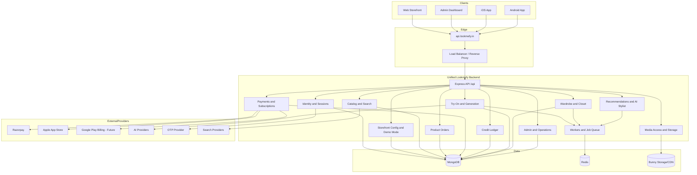
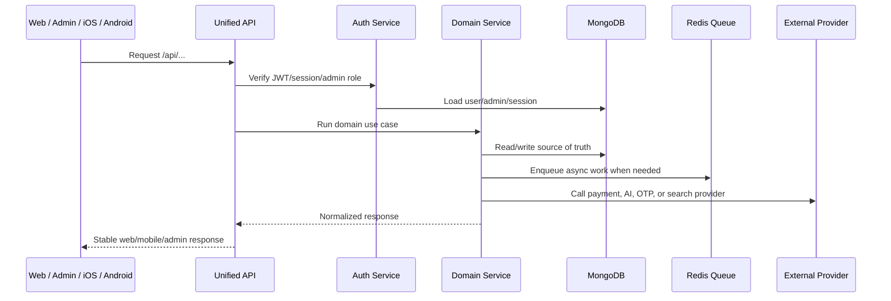
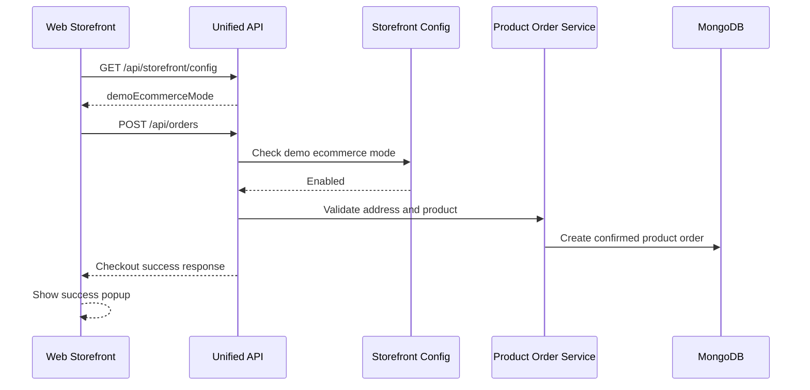
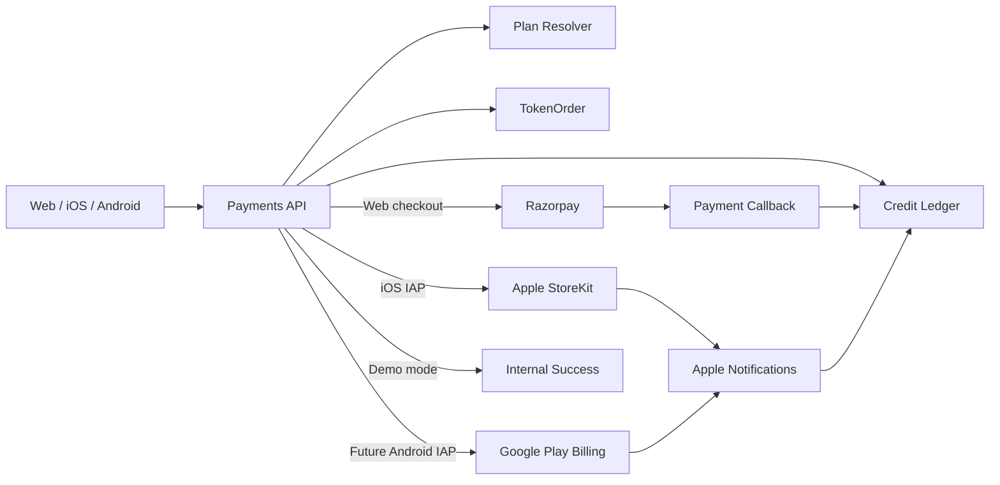
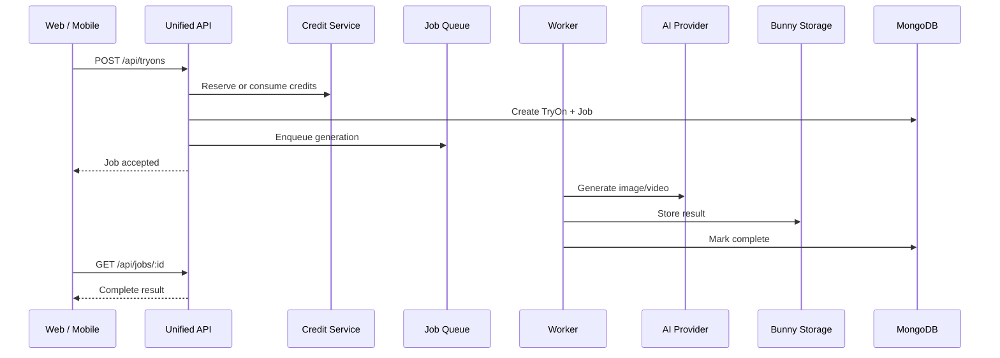
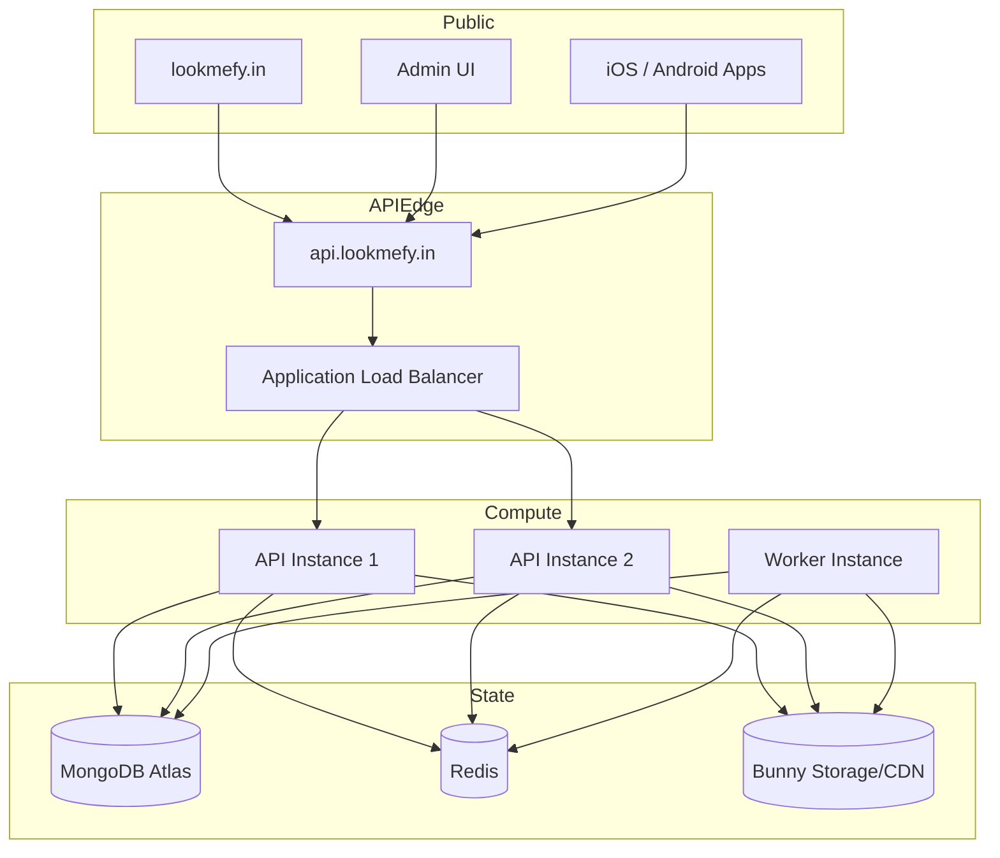

# Unified Backend Plan

## Goal

Create one backend that manages the full Lookmefy platform:

- Public web storefront
- Admin dashboard
- Mobile app backend for iOS and Android
- Product catalog, affiliate mode, and ecommerce demo mode
- Product checkout and product orders
- Credits, subscriptions, top-ups, and payment provider flows
- AI try-on, video generation, job queues, and media storage
- Wardrobe, closet, recommendations, AI stylist, and user profile
- Observability, rate limits, security, admin controls, and deployment operations

The unified backend should become the single API surface for:

```txt
https://api.lookmefy.in/api
```

Implementation is being done phase by phase in the isolated `fitlook-unified` branch, not in the deployed working folder.

## Implementation Progress

### Phase 1 - Shared Model Foundation

Status: complete.

Added the app-compatible model fields needed before route migration:

- Extended `User` with mobile/app profile fields, avatar fields, phone verification metadata, password-state metadata, and richer subscription provider state.
- Extended `TokenOrder` with app-compatible purchase metadata, provider ids, rate-per-credit, and subscription renewal fields.
- Added `CreditEvent` as the canonical audit trail for every credit balance mutation.
- Added `AppleTransaction` as the canonical Apple IAP and App Store Server Notification record.
- Added model coverage in `tests/unified-models.test.js`.

### Phase 2 - Credit Ledger Service

Status: complete.

Created a shared ledger service that future web, admin, iOS, and Android flows can call instead of mutating `User.tokens` directly:

```txt
server/services/creditLedger.js
```

Implemented:

- `creditUser(...)`
- `debitUser(...)`
- `applyCreditLedgerEntry(...)`
- Positive ledger event amounts with explicit `credit` / `debit` direction.
- Idempotent fulfillment keys for payment callbacks and app-store purchase fulfillment.
- Atomic debit protection using `tokens >= cost`.
- Optional user profile/subscription updates during a ledger credit.

First integration completed:

- Token purchase fulfillment in `server/routes/payments.js` now credits users through the ledger.
- Demo credit orders are explicitly marked as `provider: "demo"`.
- Existing Razorpay and legacy PhonePe reconciliation behavior remains API-compatible.

Test status:

```txt
npm test
216 passed
1 skipped
```

### Phase 3 - iOS StoreKit Payment Unification

Status: complete.

Ported the mobile app's Apple purchase verification foundation into the root backend:

- Added Apple StoreKit server dependency to the root package.
- Added `server/utils/appleStoreKit.js` for App Store Server API access, signed payload verification, product mapping, app-account-token mapping, subscription status normalization, and certificate/private-key loading.
- Added mobile-compatible Apple endpoints under the existing payments mount:

```txt
GET  /api/payments/apple/config
POST /api/payments/apple/transactions
POST /api/payments/apple/restore
GET  /api/payments/apple/status
POST /api/payments/apple/notifications
```

- Apple consumable and subscription purchases now resolve into `AppleTransaction` records.
- Apple credit grants now use the shared `CreditEvent` ledger via `creditUser(...)`.
- Apple subscription state now writes into the unified `User.subscription` object.
- Added Apple IAP readiness to `/api/health/ready`.
- Documented Apple IAP env placeholders in `.env.example`.
- Added Apple coverage in `tests/apple-payments.test.js` and updated env validation coverage.

Test status:

```txt
npm test
222 passed
1 skipped
```

### Phase 4 - Mobile Auth Compatibility

Status: complete.

Added mobile-compatible auth routes onto the main backend without bringing back the separate app OTP store:

```txt
POST /api/auth/otp/send
POST /api/auth/otp/verify
POST /api/auth/signup/complete
POST /api/auth/password/reset
```

Implemented:

- Mobile OTP purposes for signup, login, and password reset.
- Signup and reset action tokens after verified OTP.
- Phone-only mobile signup using deterministic internal email addresses.
- Immediate mobile login response after password reset.
- Shared password hashing, account-status checks, sessions, media tokens, and OTP delivery.

### Phase 5 - Mobile Media And Profile Compatibility

Status: complete.

Merged the mobile profile/media behavior into the main auth backend:

```txt
GET   /api/auth/media/:kind/:id
PATCH /api/auth/profile
PATCH /api/auth/avatar-crop
POST  /api/auth/body-photo
```

Implemented:

- Profile uploads now create both `bodyPhoto` and `avatarPhoto`.
- Generated full-body profile results now refresh the avatar and clear stale crop data.
- Avatar crop settings are saved on the unified `User.avatarCrop` field.
- User media cleanup includes avatar files.
- Mobile protected profile-media access uses the existing user media token model.

Test status:

```txt
npm test
226 passed
1 skipped
```

### Phase 6 - Mobile Domain Route Compatibility

Status: complete.

Added the next route-compatibility slice for mobile app screens that still expected the old app backend:

```txt
GET /api/jobs/:jobId
GET /api/tryons/history
GET /api/tryons/credit-history
GET /api/tryons/custom/latest
```

Implemented:

- Mobile job polling alias maps BullMQ `completed` into app status `succeeded`.
- Mobile job polling returns top-level `result` when the job succeeds.
- Try-on history now merges product, custom, and external try-ons into one mobile-friendly list.
- Credit history now reads from the shared `CreditEvent` ledger.
- Latest custom try-on endpoint is preserved for app profile/studio screens.

### Phase 7 - Remaining Domain Merge Plan

Status: complete for backend compatibility, payment client cleanup, job-worker finalization, and recommendation chat compatibility.

Implemented in this phase:

```txt
GET  /api/recommendations/recent-searches
POST /api/recommendations/studio-chat
POST /api/recommendations/stylist-chat
POST /api/payments/phonepe/top-up
GET  /api/payments/subscriptions/current/status
POST /api/payments/subscriptions/current/cancel
GET  /api/tryons/image/:scope/:id
GET  /api/tryons/video/:scope/:id
GET  /api/tryons/garment/:scope/:id
GET  /api/closet/media/:kind/:id
```

Notes:

- AI Studio now has a root-owned local knowledge base for Lookmefy features, token rules, try-on readiness, wardrobe rules, and product search rules.
- AI Studio and Stylist Chat now return a unified `brain`, `reply`, `products`, `suggestions`, `actions`, `rag`, `intent`, and `mode` payload for web, admin-adjacent clients, iOS, and Android.
- Fashion shopping prompts still use catalog-backed product results, while token/try-on/wardrobe/platform help prompts return knowledge-backed assistant replies without forcing fake product search.
- Recent searches are preserved for mobile search screens.
- Old mobile route names under `/payments/phonepe/...` now return Razorpay checkout payloads instead of creating PhonePe payments.
- Razorpay does not provide a hosted `paymentUrl` from the Orders API; mobile should open Razorpay through SDK/native checkout using the returned `razorpay` payload.
- Subscription status/cancel reads and updates the unified `User.subscription` record.
- Try-on history now emits signed mobile-compatible media proxy URLs for generated product, custom, and external try-ons.
- Closet item/outfit responses now emit signed mobile-compatible media proxy URLs for item images, outfit images, and generated garment composites.
- Media proxy routes validate the signed private media token and record ownership before streaming stored bytes or provider-held video.
- Mobile credit checkout now uses Razorpay-facing copy, calls the provider-neutral `/payments/checkout` route, opens native Razorpay checkout with the returned payload, and verifies the payment through `/payments/razorpay/verify`.
- The app web shell token checkout now loads Razorpay browser checkout and verifies paid orders through the unified backend.
- `react-native-razorpay` was added to the mobile app dependency list, so native iOS/Android builds must be rebuilt before the mobile Razorpay path can run on devices.
- Root job execution is now treated as canonical BullMQ infrastructure through `server/utils/jobQueue.js` and `scripts/worker.js`.
- Job polling keeps old mobile aliases (`status`, `type`, `attempts`, `updatedAt`, top-level `result`) while preserving queue-specific BullMQ fields for web/admin clients.

Client cutover verification:

- Mobile production API configuration points to `https://api.lookmefy.in/api`.
- Mobile token checkout uses the provider-neutral checkout route and Razorpay verification path.
- Root repository keeps the nested `fit-look-APP/` workspace ignored so unified backend pushes do not accidentally ship the old app backend.
- Web and admin production builds complete successfully from this branch.

Remaining implementation slices:

1. None for backend unification in this branch.
2. Old app backend retirement is intentionally out of scope until you decide to stop using or archive that deployment path.

Test status:

```txt
npm test
245 passed
1 skipped
```

Build status:

```txt
npm run build
passed

npm run admin:build
passed
```

## Repository Findings

### Main Web Backend

Location:

```txt
server/
```

This is the stronger base for the unified backend because it already has:

- Express API mounted under `/api`
- Admin routes and admin authentication
- RBAC-style admin permissions
- Storefront settings and demo ecommerce toggle
- Product order model and checkout flow
- Product catalog routes
- Recommendation event routes
- Try-on routes and queue integration
- Security headers and request hardening
- Metrics, audit logs, system incident models
- Redis and BullMQ style job queue support
- Bunny storage integration
- Razorpay payment integration for token orders

### Mobile App Backend

Location:

```txt
fit-look-APP/server/
```

This backend contains app-specific logic that must be merged into the main backend:

- Mobile auth behavior
- OTP verification flow
- Apple in-app purchase transaction handling
- Apple App Store server notification handling
- Mobile subscription state fields
- Mobile token/top-up flows
- App-oriented closet and wardrobe flows
- App-oriented try-on and custom try-on flows
- App media access behavior
- Mobile job model and job status behavior

Important files found:

```txt
fit-look-APP/server/index.js
fit-look-APP/server/routes/auth.js
fit-look-APP/server/routes/closet.js
fit-look-APP/server/routes/jobs.js
fit-look-APP/server/routes/payments.js
fit-look-APP/server/routes/products.js
fit-look-APP/server/routes/recommendations.js
fit-look-APP/server/routes/tryons.js
fit-look-APP/server/models/AppleTransaction.js
fit-look-APP/server/models/CreditEvent.js
fit-look-APP/server/models/Job.js
fit-look-APP/server/utils/appleStoreKit.js
fit-look-APP/server/utils/mediaAccess.js
```

### Mobile Client API

Location:

```txt
fit-look-APP/mobile/
```

The mobile app already expects the production API base to be:

```txt
https://api.lookmefy.in/api
```

That means the target architecture should keep the same base URL and support mobile-compatible routes while gradually replacing the separate app backend.

## Target Architecture



## Request Flow



## Main Design Principle

The unified backend should be a modular monolith first, not microservices.

Reason:

- Current codebase is already Express and Mongo based.
- Admin, web, and app flows share users, products, credits, try-ons, and payments.
- A single backend reduces deployment confusion, duplicate routes, and inconsistent models.
- Workers can still run as separate processes using the same codebase.

Recommended runtime roles:

```txt
APP_ROLE=api       -> serves HTTP routes
APP_ROLE=worker    -> processes queues
APP_ROLE=combined  -> local development only
```

## Domain Ownership

### 1. Identity And Accounts

Unified responsibility:

- Email/password login
- OTP login or verification
- Mobile auth
- Admin auth
- JWT/session issuing
- Password reset
- User profile
- Avatar/photo profile
- Account deletion
- Rate limits and abuse prevention

Models to consolidate:

```txt
User
UserSession
AdminUser
AdminAuditLog
```

Required merge work:

- Keep the stronger password and session fields from the main backend.
- Bring over app fields such as phone verification, avatar crop, mobile subscription provider details, and app preferences if still needed.
- Avoid two separate definitions of `User`.

### 2. Storefront And Feature Flags

Unified responsibility:

- Demo ecommerce mode
- Affiliate mode
- Checkout display behavior
- Public policy wording mode
- Web feature flags
- App feature flags
- Platform-specific config

Model:

```txt
StorefrontSetting
```

Target endpoints:

```txt
GET   /api/storefront/config
PATCH /api/admin/storefront/config
GET   /api/config/app
GET   /api/config/web
```

### 3. Catalog And Product Search

Unified responsibility:

- Product listing
- Product details
- Product recommendations
- Affiliate link handling
- Demo ecommerce product behavior
- Search provider integrations
- Category and gender filters
- Admin product management

Models:

```txt
Product
RecommendationEvent
```

Required merge work:

- Compare root `Product` model and app `Product` model.
- Keep fields needed by web and admin.
- Preserve any mobile app fields consumed by `fit-look-APP/mobile`.
- Do not expose admin-only product data to public clients.

### 4. Product Orders

Unified responsibility:

- Product checkout
- India delivery address validation
- Pincode lookup and state/city autofill
- Demo checkout success behavior
- Product order status
- Admin product order management
- Future real ecommerce payment provider settlement

Model:

```txt
ProductOrder
```

Flow:



Important behavior:

- Product Buy Now requires login.
- In demo ecommerce mode, checkout confirms inside Lookmefy and does not redirect to a payment gateway.
- Public UI should not mention "demo".
- Internal admin metadata can still store demo/provider state clearly.

### 5. Credits, Tokens, Payments, And Subscriptions

Unified responsibility:

- Credit packs
- Monthly subscriptions
- Top-ups
- Razorpay web checkout flows
- Apple in-app purchase flows for iOS
- Future Google Play Billing for Android
- Credit granting
- Credit history
- Subscription state
- Payment webhooks/callbacks
- Idempotent crediting

Models to consolidate:

```txt
TokenOrder
CreditLedger or CreditEvent
AppleTransaction
```

Recommended model direction:

- Keep `TokenOrder` for provider orders and subscription purchases.
- Add or promote `CreditEvent` into a first-class `CreditLedger`.
- Keep `AppleTransaction` for iOS purchase verification and audit.
- Ensure every token balance change has a ledger row.

Payment architecture:



Important behavior:

- Storefront demo mode controls product checkout only; token buying should still open Razorpay test or live checkout.
- Token credits should be added only after Razorpay signature/payment verification.
- Outside demo mode, Razorpay test or live checkout opens for web top-ups and credits only after verification.
- iOS should use Apple IAP where required by App Store rules.
- Android payment choice should be checked against Play Store policy; Google Play Billing may be needed for digital credits depending on distribution rules.

Mobile payment endpoints to preserve:

```txt
GET  /api/payments/plans
GET  /api/payments/apple/config
POST /api/payments/apple/transactions
POST /api/payments/apple/restore
GET  /api/payments/apple/status
POST /api/payments/apple/notifications
POST /api/payments/checkout
POST /api/payments/razorpay/verify
GET  /api/payments/orders/:merchantOrderId/status
GET  /api/payments/subscriptions/current/status
POST /api/payments/subscriptions/current/cancel
POST /api/payments/subscriptions/:merchantSubscriptionId/renewals
POST /api/payments/razorpay/webhook
```

### 6. AI Try-On, Video, And Jobs

Unified responsibility:

- Image try-on
- Video generation
- Custom try-ons
- Full-body profile generation
- External product try-ons
- Job status
- Retry behavior
- Queue mode selection
- Provider routing

Models:

```txt
TryOn
CustomTryOn
Job
GenerationMetric
```

Required merge work:

- Root backend already has job queue infrastructure.
- App backend has a `Job` model and mobile job expectations.
- Decide whether job state lives in Mongo, Redis, or both.
- Preserve mobile app route compatibility for job polling.

Target flow:



### 7. Wardrobe And Closet

Unified responsibility:

- Closet items
- Closet image analysis
- Outfit generation
- Closet suggestions
- Closet chat
- Saved wardrobe looks
- User-owned media permissions

Models:

```txt
ClosetItem
ClosetOutfit
User
```

Endpoints to preserve:

```txt
GET    /api/closet
POST   /api/closet/items/analyze
POST   /api/closet/items
POST   /api/closet/outfits/generate
POST   /api/closet/suggest
POST   /api/closet/chat
```

### 8. Recommendations And AI Stylist

Unified responsibility:

- Recent searches
- Recommendation events
- Studio chat
- Product suggestions
- Try-on suggestions
- Admin analytics around recommendations

Endpoints to preserve:

```txt
GET  /api/recommendations/recent-searches
POST /api/recommendations/events
POST /api/recommendations/studio-chat
```

### 9. Media

Unified responsibility:

- User avatar images
- Body photos
- Try-on source images
- Generated outputs
- Closet item images
- Signed or protected media access
- CDN URL normalization

Required merge work:

- Root backend has Bunny storage integration.
- App backend has mobile-specific `mediaAccess` logic.
- Unified backend should centralize access checks so web and mobile get the same security behavior.

Target route pattern:

```txt
GET /api/media/:kind/:id
```

Backward-compatible alias if mobile already calls:

```txt
GET /api/auth/media/:kind/:id
```

### 10. Admin And Operations

Unified responsibility:

- Admin login
- Product management
- Storefront mode toggle
- Product order review
- Credit order review
- User support tools
- Audit logs
- Metrics
- Incidents
- System health
- Queue status
- Provider status

Models:

```txt
AdminUser
AdminAuditLog
RequestMetric
GenerationMetric
OtpDeliveryMetric
SystemIncident
```

Admin should control all platform surfaces:

```txt
Web storefront
Admin dashboard
iOS app
Android app
AI generation settings
Payment mode settings
Feature flags
```

## API Layout

Recommended final route structure:

```txt
/api/auth
/api/admin
/api/config
/api/storefront
/api/products
/api/orders
/api/payments
/api/credits
/api/tryons
/api/jobs
/api/closet
/api/recommendations
/api/media
/api/images
/api/health
/api/metrics
```

Compatibility rule:

- Keep old mobile routes working until all released mobile builds are migrated.
- New route names can be cleaner, but old app routes need aliases or stable behavior.
- Deprecate old routes only after mobile app versions using them are no longer supported.

## Data Model Consolidation

### User

Unify fields from both backends:

```txt
identity:
  email
  passwordHash
  phone
  phoneVerifiedAt
  authVersion
  accountStatus

profile:
  name
  username
  avatarPhoto
  avatarCrop
  bodyPhoto
  onboardingSeenAt

credits:
  tokenBalance
  totalTokensPurchased
  totalTokensUsed

subscription:
  provider
  status
  planId
  currentPeriodStart
  currentPeriodEnd
  appleOriginalTransactionId
  phonePeSubscriptionId
  cancelAtPeriodEnd

preferences:
  platform
  notification settings
  app flags
```

### TokenOrder

Use for paid or demo credit purchases:

```txt
user
planId
purchaseType
orderType
provider
providerOrderId
providerSubscriptionId
amount
currency
credits
status
providerState
creditedAt
idempotencyKey
rawProviderResponse
```

### CreditLedger

Use for every balance mutation:

```txt
user
sourceType
sourceId
delta
balanceAfter
reason
metadata
createdAt
```

This avoids future confusion about whether credits were granted by Razorpay, Apple, admin, promo, refund, or demo mode.

### ProductOrder

Use for ecommerce product checkout:

```txt
user
items
contactName
contactPhone
address
pincode
city
state
shippingStatus
paymentMode
paymentStatus
orderStatus
internalNotes
createdAt
updatedAt
```

### AppleTransaction

Keep as a provider audit model:

```txt
user
productId
transactionId
originalTransactionId
appAccountToken
environment
status
creditsGranted
purchaseDate
expiresDate
signedTransactionInfo
rawPayload
```

## Deployment Architecture



Important deployment rule:

- Every healthy target behind the load balancer must run the same deployed commit.
- If one instance has older code, users will randomly get 404s depending on which target receives traffic.
- The unified backend should include a `/api/health/version` endpoint that returns commit SHA, app role, and instance name.

## Environment Groups

Do not keep one huge mixed `.env` forever. Split variables by responsibility:

```txt
Core:
  NODE_ENV
  PORT
  CLIENT_ORIGIN
  ADMIN_ORIGIN
  ALLOWED_ORIGINS

Database:
  MONGODB_URI
  MONGODB_DB
  REDIS_URL
  REDIS_KEY_PREFIX

Security:
  JWT_SECRET
  PASSWORD_* settings
  rate limit settings

Storage:
  STORAGE_PROVIDER
  BUNNY_* settings

Payments:
  PHONEPE_* settings
  APPLE_* settings
  GOOGLE_PLAY_* settings

AI:
  AI_PROVIDER
  PRUNA_* settings
  FAL_* settings
  FITROOM_* settings

Messaging:
  OTP_DELIVERY_PROVIDER
  MSG91_* settings

Operations:
  METRICS_* settings
  AWS_COST_* settings
  NGINX_STATUS_URL
  INSTANCE_NAME
  APP_ROLE
```

No secrets should be committed to GitHub.

## Migration Plan

### Phase 0: Freeze And Inventory

- Freeze route additions in the separate app backend.
- Inventory every mobile API call from `fit-look-APP/mobile`.
- Inventory every admin and web API call from root frontend and admin frontend.
- Create a route compatibility checklist.
- Decide which models from app backend are canonical, merged, or retired.

### Phase 1: Route Compatibility In Main Backend

- Add missing app-compatible endpoints to the main backend.
- Keep response shapes mobile-compatible.
- Add aliases where route names differ.
- Add tests for every mobile route expected by released apps.

### Phase 2: Model Merge

- Merge `User` fields carefully.
- Bring `AppleTransaction`, `CreditEvent`, and `Job` equivalents into main backend.
- Add migrations/backfills if existing Mongo documents need new fields.
- Avoid dropping fields until production traffic confirms they are unused.

### Phase 3: Payments Merge

- Move Apple StoreKit verification into main backend.
- Normalize Razorpay top-up, subscription, verification, and webhook handling.
- Add a single credit ledger path for all providers.
- Ensure demo mode bypasses provider redirect while still logging internal order records.

### Phase 4: Try-On And Jobs Merge

- Decide one job state model.
- Keep API instances stateless.
- Run long AI tasks in workers.
- Make job polling consistent for web and mobile.

### Phase 5: Media Merge

- Centralize media access rules.
- Normalize Bunny/CDN URL generation.
- Preserve old `/auth/media/:kind/:id` route as an alias if mobile builds need it.

### Phase 6: Client Cutover

- Point web, admin, iOS, and Android to the same API host.
- Release mobile builds only after route compatibility tests pass.
- Keep feature flags server-side so app releases are not needed for every backend behavior change.

### Phase 7: Retire App Backend

- Stop deploying `fit-look-APP/server`.
- Keep `fit-look-APP/mobile` as the mobile client.
- Archive old app backend routes once no production client depends on them.

## Testing Plan

### Backend Tests

- Auth: signup, login, OTP, password reset, account deletion
- Admin: login, permissions, storefront toggle, product/order management
- Storefront: config, demo mode, affiliate mode
- Product checkout: logged-in required, address validation, pincode autofill, order success
- Credit checkout: Razorpay checkout path, signature verification, idempotency
- Apple IAP: transaction verification, restore, status, server notifications
- Product catalog: list, detail, filters, search
- Try-on: create job, poll job, credit consumption, failure refund if applicable
- Closet: item create, analyze, outfit generation, chat
- Recommendations: events, recent searches, studio chat
- Media: owner access, unauthorized access, CDN URL handling

### Integration Tests

- Web Buy Now in demo mode creates a product order and shows success.
- Web Buy Now while logged out redirects or prompts login/signup.
- Token top-up opens Razorpay even when product demo ecommerce mode is enabled.
- Token top-up verifies the Razorpay checkout signature server-side before crediting.
- iOS purchase verification grants credits once.
- Duplicate payment callbacks do not grant credits twice.
- Admin can see product orders and credit orders.
- Load balancer targets all return same `/api/health/version`.

### Mobile Compatibility Tests

- Run contract tests against all routes used in `fit-look-APP/mobile`.
- Test with iOS simulator.
- Test with Android emulator.
- Confirm old app builds still work if aliases are required.

## Operational Plan

### Health Endpoints

Recommended:

```txt
GET /api/health
GET /api/health/version
GET /api/health/providers
GET /api/admin/ops/queues
```

`/api/health/version` should return:

```json
{
  "ok": true,
  "commit": "git-sha",
  "instanceName": "fitlook-api-1",
  "appRole": "api",
  "startedAt": "timestamp"
}
```

### Deployment Rules

- Deploy the same commit to every API instance.
- Restart every API service after pulling.
- Verify local instance health on port 5050.
- Verify public API health through `https://api.lookmefy.in`.
- Only then update web/admin/mobile clients if needed.

### Load Balancer Rule

One API target group can contain multiple backend instances. That is fine.

The problem happens when:

- Target A has new code.
- Target B has old code.
- The load balancer randomly sends requests to both.

The fix is not separate target groups for versions. The fix is a consistent deploy process and a version health endpoint.

## Admin Control Plane

Admin should eventually manage:

- Demo ecommerce mode
- Product order status
- Credit packs and token pricing
- Payment mode settings
- App config flags
- AI provider selection
- Queue status
- Failed generation retries
- User credit adjustments
- User account support
- Policy copy mode
- Mobile minimum supported version
- Maintenance banners

## Security Requirements

- Never expose provider secrets to frontend or mobile apps.
- Keep Apple, Razorpay, AI, storage, and OTP secrets server-side only.
- Use idempotency keys for payment and credit grant flows.
- Log provider callbacks but redact sensitive payload fields.
- Use admin audit logs for all admin-side state changes.
- Keep rate limits configurable but do not remove them globally.
- Require auth for Buy Now in ecommerce mode.
- Require auth for token purchases.
- Validate ownership for media and generated assets.

## Key Decisions Needed

### 1. Canonical Backend

Recommendation:

```txt
Use root server/ as the canonical unified backend.
Port required app backend features from fit-look-APP/server into it.
```

### 2. Credit Ledger

Recommendation:

```txt
Make CreditEvent/CreditLedger mandatory for every credit balance mutation.
```

### 3. iOS Payments

Recommendation:

```txt
Keep Apple IAP for iOS digital credits and subscriptions.
```

### 4. Android Payments

Recommendation:

```txt
Review Play Store policy before finalizing Android digital credit payments.
Keep backend ready for Google Play Billing even if Razorpay remains active first.
```

### 5. Product Checkout

Recommendation:

```txt
Keep product checkout separate from token checkout.
Product orders use ProductOrder.
Credit purchases use TokenOrder plus CreditLedger.
```

### 6. Job System

Recommendation:

```txt
Use Redis/BullMQ for execution and Mongo for durable user-visible job records.
```

## Suggested Implementation Order

1. Add route inventory and compatibility tests.
2. Merge model fields without changing behavior.
3. Port Apple payment routes into root backend.
4. Normalize credit ledger.
5. Port missing mobile auth and media behavior.
6. Port missing mobile closet and try-on behavior.
7. Add `/api/health/version`.
8. Deploy same commit to every backend target.
9. Point mobile app to unified backend and run simulator tests.
10. Retire separate app backend deployment.

## Definition Of Done

The unified backend is complete when:

- Web storefront uses the unified API.
- Admin dashboard uses the unified API.
- iOS app uses the unified API.
- Android app uses the unified API.
- No production client depends on `fit-look-APP/server`.
- All payment providers grant credits through one ledger path.
- Product orders and credit orders are clearly separated.
- Admin can manage web, app, product, payment, and operations behavior.
- Load-balanced API instances all return the same version.
- Route compatibility tests pass for web, admin, iOS, and Android.
- Secrets remain outside GitHub.
